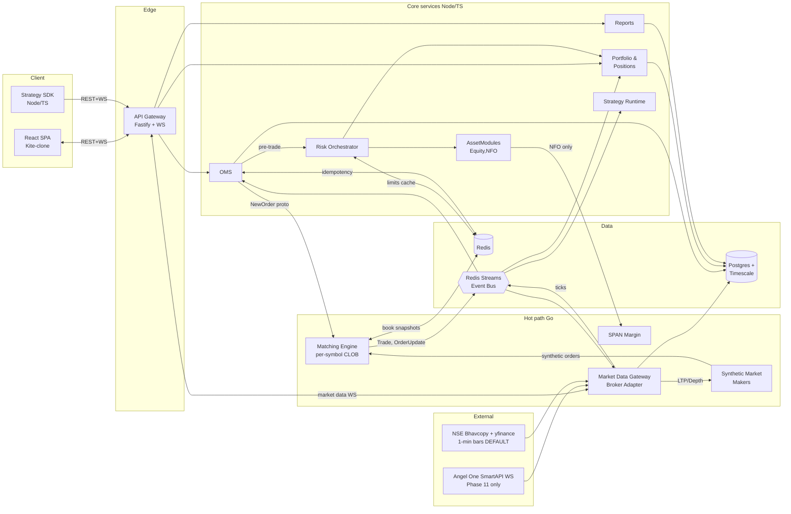
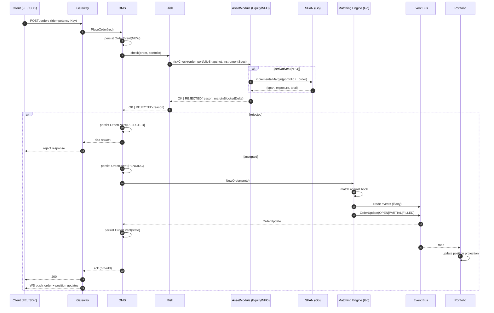
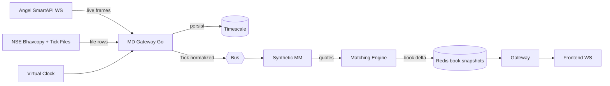

# 02 — Architecture

## Bounded contexts (services)

| Service           | Lang | Owns                                           | Exposes       |
| ----------------- | ---- | ---------------------------------------------- | ------------- |
| `gateway`         | TS   | Auth stub, WS fan-out, FE↔BE routing           | REST, WS      |
| `oms`             | TS   | Order lifecycle, event log, idempotency        | REST, Bus     |
| `risk`            | TS   | Pre-trade checks, limits, margin orchestration | REST, Bus     |
| `portfolio`       | TS   | Positions & holdings projection, P&L, ledger (asset-agnostic core) | REST, Bus |
| `reports`         | TS   | Contract notes, P&L reports, margin statements | REST          |
| `strategy-runner` | TS   | Hosts strategy processes                       | Internal      |
| `go/matching`     | Go   | CLOB per symbol, matching, book snapshots      | gRPC, Bus     |
| `go/md`           | Go   | Broker adapter, tick normalization, candles    | gRPC, WS, Bus |
| `go/span`         | Go   | Scenario-based margin calc (NFO module)        | gRPC          |
| `go/mm`           | Go   | Synthetic market-maker quoting                 | Bus           |

**Rule of thumb**: if it's on the order path and must be fast, it's Go. If it's stateful business logic that changes often, it's TS.

## Asset-class plug-in boundary (Equity-first)

Core services are intentionally **asset-agnostic**. Anything that varies by asset class (cash equity vs. derivatives) is implemented behind a small set of **asset modules**. v1 ships the **Equity module** first; NSE F&O is added later as a second module.

### Canonical instrument model

Every request and event ultimately references an `instrument_id` which resolves (via the instrument master) to an `InstrumentSpec` containing:

- `assetClass`: `EQUITY` | `DERIVATIVES`
- `segment`: `NSE_EQ` | `NFO`
- `instrumentType`: `EQ` | `FUT` | `OPT`
- `tradingConstraints`: `tickSize`, `lotSize`, `freezeQty`, price bands, product availability (CNC/MIS/NRML)
- `contract`: optional derivative metadata (`expiry`, `strike`, `optionType`, `underlyingInstrumentId`, `lotSize`)

#### Events: what to include vs. derive

Core events and tables should store `instrument_id` as the durable identifier. Most context (`assetClass`, `segment`, `instrumentType`, constraints) is **derived** at read-time by resolving `instrument_id → InstrumentSpec` (cached).
Duplicate fields can be included in event payloads for debugging/query ergonomics, but must be treated as **denormalized hints** (the source of truth remains `ref.instruments`).

### Asset module contracts (owned by domain, called by core)

The core services depend on these contracts; the module implementation depends on reference data and (optionally) specialized engines like SPAN:

- **OrderSemantics**: validate order request given `InstrumentSpec` and market session state.
  Example differences: CNC short-sell rules, derivatives product types, expiry cutoffs.
- **RiskModel**: pre-trade margin check + **margin block/release** semantics.
  Equity: VAR+ELM (or conservative default). NFO: SPAN+Exposure via `go/span`.
- **PositionModel**: how trades aggregate into positions/holdings, MTM and expiry handling.
  Equity: T+1 holdings + intraday positions. NFO: daily MTM + expiry settlement.
- **SettlementModel**: end-of-day jobs and corporate actions hooks.

Implementation shape (language-agnostic): core services call `AssetModules` by `assetClass`/`segment`; module logic returns deterministic results and structured reject codes/events.

## High-level diagram

## Order lifecycle sequence

## Market data flow

## Service boundaries & ownership rules

1. **One DB per bounded context** (logical, not physical). Services never read each other's tables. Same Postgres instance in v1, but schemas: `oms`, `portfolio`, `reports`, `md`. Cross-service reads go via bus events or service APIs.
2. **Event log is the source of truth**. `oms.order_events` is append-only. `oms.orders`, `portfolio.positions`, `portfolio.holdings` are all projections rebuildable from the event log + trade log.
3. **Matching engine is authoritative for order state transitions**. OMS persists what ME emits; it does not decide fills.
4. **Risk is synchronous on the order path** (pre-trade). Post-trade surveillance (OTR, kill switch) is asynchronous off the bus.
5. **No distributed transactions**. Every cross-service write is compensable via replay or reversal entry.

## Data flow patterns

- **Commands** (from clients): `PlaceOrder`, `CancelOrder`, `ModifyOrder`. REST, synchronous, idempotent.
- **Events** (on the bus): `OrderPlaced`, `OrderRejected`, `OrderUpdated`, `Trade`, `PositionUpdated`, `Tick`, `Candle1m`, `DayClosed`, `CorpActionApplied`.
- **Queries**: REST from FE to service (no projection query crosses a service boundary).

## Topology / ports (dev)

| Service         | Port        |
| --------------- | ----------- |
| FE (Vite)       | 5173        |
| Gateway         | 4000        |
| OMS             | 4010        |
| Risk            | 4020        |
| Portfolio       | 4030        |
| Reports         | 4040        |
| Strategy Runner | 4050        |
| Matching (gRPC) | 6001        |
| MD (gRPC + WS)  | 6010 / 6011 |
| SPAN (gRPC)     | 6020        |
| Postgres        | 5432        |
| Redis           | 6379        |
| Grafana         | 3000        |
| Prometheus      | 9090        |
| Tempo           | 3200        |
| Loki            | 3100        |

## Scaling story (to discuss in interviews, even if not built)

- **Matching engine**: partition by symbol across N processes; each symbol pinned to one goroutine (single-writer principle → no locks inside the book). To scale further: shard across hosts, stateful routing at gateway.
- **OMS**: stateless at the HTTP layer; scale horizontally. Idempotency via Redis SETNX. Event log is the bottleneck → partition by `user_id` or by `symbol_group`.
- **MD gateway**: one process per upstream broker connection; publishes to bus; consumers scale independently.
- **SPAN**: stateless; scale horizontally; cache per-symbol risk arrays in Redis.
- **Frontend / Gateway**: trivially horizontal behind a load balancer; WS stickiness via consistent hashing on `user_id`.
- **Persistence**: Postgres primary + read replicas for reports. Timescale compression + retention for ticks.

## Failure modes covered

| Failure        | Response                                                                                                   |
| -------------- | ---------------------------------------------------------------------------------------------------------- |
| ME crash       | Replay event log on boot; book reconstructed; clients reconnect WS.                                        |
| MD disconnect  | Reconnect with exponential backoff; mark symbols `STALE`; reject new orders on stale symbols.              |
| Postgres down  | OMS fails fast (return 503); risk returns 503. No order acknowledged without persistence.                  |
| Redis down     | Fall back to DB for idempotency; rate-limit disabled with alert.                                           |
| Bus lag        | Consumers track lag metric; alert > 5s; orders are not dependent on bus for ack.                           |
| Strategy crash | Supervisor restarts; strategy has to re-subscribe; no position leakage because portfolio is authoritative. |

## What's intentionally *not* in v1

- Cross-region HA.
- Horizontal sharding of the matching engine.
- Separate physical DBs per context.
- Service mesh (Istio / Linkerd).

These are explicit ADR candidates for the "v2 scaling" narrative.