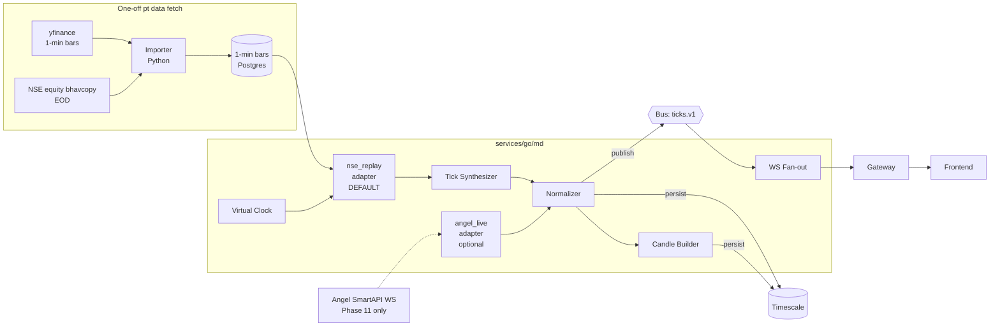

# Phase 1 — Market Data Gateway

**Week 2 · ~20 hrs**

Goal: a single `BrokerAdapter` interface fed by historical NSE **equity** data (default dev mode), with the `angel_live` adapter present but optional. By the end, you can render candles for liquid cash symbols (e.g. INFY, RELIANCE) at 100× speed from data sitting on your laptop. **F&O / NFO** ingestion and replay are explicitly deferred to the [NFO asset module](../repo-layout.md) and later phases — no Phase 1 dependency on derivatives data.

## Core principle: replay-first

**Default mode is `nse_replay`.** Full **`angel_live`** production wiring stays a later milestone (Phase 11 in this repo), but that schedule is about **focus and hardening**, not because Angel blocks market data from a home IP. Everything you build Phases 1–10 targets replay, because:

- No dependency on Angel API keys, TOTP, or session refresh while iterating.
- **Deterministic** — same inputs produce same outputs, which is critical for Phase 9 (strategy backtest parity).
- Works offline, at 100×/1000× speed, on any machine.
- Lets you replay market-stress days (Budget day, covid-crash day, etc.) on demand to test edge cases. **Expiry / roll dynamics** stay in the NFO plug-in when you add it.

See [Angel SmartAPI: orders vs market data and IP](#angel-smartapi-orders-vs-market-data-and-ip) for how API keys and IP whitelist interact (static IP is **not** required for live **market data** in the usual Angel setup if you are not placing orders through their order APIs).

The adapter interface is the contract; the rest of the system doesn't know or care which adapter is active.

## Prerequisites

- Phase 0 complete.
- Python 3.11+ installed (for the one-off data fetcher script; the services themselves are Go).
- ~5 GB free disk for ~1 year of 1-min bars for ~50 symbols.
- **Optional**: Angel One SmartAPI **API key + secret** (+ TOTP secret for login) if you want to experiment with **`angel_live`** market data from your machine. Register the app with your **current public IP** if you are **not** using Angel’s order-placement APIs (this project’s live orders stay in-house). A **dedicated / static IP or VPS** matters mainly when you need stable egress or when calling **order** endpoints that enforce IP whitelist—confirm on the Angel developer dashboard.

## Deliverables

- `services/go/md` exposes a normalized WS `/stream?symbols=...` emitting `Tick` events.
- `BrokerAdapter` interface with two implementations: `nse_replay` (default), `angel_live` (optional).
- `pt data fetch` CLI downloads and normalizes historical data into `md.ticks` + bars.
- `pt instruments sync` CLI populates `ref.instruments` from Angel's public scrip master (no auth needed).
- `pt replay` CLI runs virtual-clock replay against configured symbols at configurable speed.
- Tick synthesizer turns 1-min OHLCV bars into plausible intra-bar ticks.
- Continuous aggregates for 1m / 5m / 15m / 1h / 1d queryable.
- `/candles` and `/instruments` REST endpoints on Gateway.
- Grafana panel: tick rate, staleness, per-adapter reconnect count.
- ADR-0005 (broker-adapter abstraction), ADR-0019 (tick synthesis model).
- Talking-points doc for Phase 1.

## Architecture




## Data sources — tiered, all free


| Tier                 | Source                                                                                                    | Auth                   | Segment               | Granularity                           | Use                         |
| -------------------- | --------------------------------------------------------------------------------------------------------- | ---------------------- | --------------------- | ------------------------------------- | --------------------------- |
| Scrip master         | [Angel public JSON](https://margincalculator.angelbroking.com/OpenAPI_File/files/OpenAPIScripMaster.json) | None                   | Full file has many segments; **Phase 1 filters to NSE equity** | Static (daily refresh)                | Phases 1+                   |
| Intraday bars        | `yfinance` (Yahoo → NSE)                                                                                  | None                   | Equity cash + indices | 1m (7d back), 5m (60d), daily (years) | Phases 1–5, 9               |
| Equity EOD OHLC      | [NSE Equity Bhavcopy](https://archives.nseindia.com/content/historical/EQUITIES/)                         | None                   | All NSE equity        | Daily                                 | Phase 6+, reconciliation    |
| Index minute data    | NSE chart API (unofficial)                                                                                | None but needs cookies | Indices               | 1m intraday                           | Optional supplement         |
| Tick-level (paid)    | TrueData / GFDL                                                                                           | Paid                   | All                   | True tick                             | Only if you subscribe later |

**Deferred (NFO / F&O plug-in, not Phase 1)**

| Tier                 | Source                                                                                                    | Notes |
| -------------------- | --------------------------------------------------------------------------------------------------------- | ----- |
| F&O EOD settlement   | [NSE F&O bhavcopy](https://archives.nseindia.com/content/historical/DERIVATIVES/)                         | Wire when you implement margin / MTM / OI for derivatives. |
| Option chain history | Upstox historical API (free with account)                                                               | Options phases / NFO module. |


**What you get with free sources for equity-first Phases 1–6**: replay, candles, and equity-centric backtests without derivatives feeds. Tick granularity is *synthesized* from 1-min bars (see [§1.4 — Tick synthesizer](#14-tick-synthesizer)) — good enough for matching-engine behavior, stop-loss triggering, and strategy P&L on cash. When you add the NFO module, plug in F&O bhavcopy / chain history behind the same ingestion boundaries. If you later need true tick data, swap in a paid source behind the same adapter.

## Replay setup — step by step

Do this on Day 1 of Phase 1.

### 1. Install the data-fetch dependency (Python, one-off)

```bash
cd infra/seed
python -m venv .venv
source .venv/bin/activate
pip install yfinance pandas requests
```

The fetcher is Python because `yfinance` is the easiest high-quality NSE source. The services are Go; Python only runs in the seed step.

### 2. Download the Angel scrip master (no auth needed)

```bash
just instruments-sync
```

Internally:

```bash
curl -o infra/seed/scrip-master.json \
  https://margincalculator.angelbroking.com/OpenAPI_File/files/OpenAPIScripMaster.json
pt instruments sync --file infra/seed/scrip-master.json
```

This populates `ref.instruments` with ~80k rows. **Phase 1**: filter to **NSE equity** (cash) only to keep lean seed + replay; retain full rows in the raw file if you want, but don’t require NFO rows for this phase.

### 3. Fetch 1-minute bars for your dev universe

```bash
just data-fetch-minute
# narrower universe (positional: symbols, then days — do not pass symbols=...):
# just data-fetch-minute INFY,RELIANCE 7
# equivalent to:
pt data fetch \
  --source=yfinance \
  --symbols=RELIANCE,INFY,TCS,HDFCBANK,ICICIBANK,SBIN \
  --interval=1m \
  --days=7
```

yfinance has a hard limit: 1-minute bars for only the **last 7 days**. Re-run this weekly to keep a rolling window (scheduler handles it in Phase 10). For longer history, use 5-minute (60 days) or daily (years) — for most Phase-1 testing, 7 days of 1-min is plenty.

Rows land in a new staging table `md.bars_1m (instrument_id, ts, open, high, low, close, volume)`.

### 4. Fetch EOD bhavcopy for the same date range

```bash
just data-fetch-bhavcopy -- --from=2026-04-10 --to=2026-04-20
# Phase 1 (equity-first): downloads and unzips each day's cm<date>bhav.csv
# into infra/seed/bhavcopy/<YYYY-MM-DD>/ then imports into md.bhav_eq.
# F&O fo<date>bhav.csv → md.bhav_fo is deferred to the NFO plug-in / later phase.
```

**Phase 1**: populate **`md.bhav_eq`** only. **`md.bhav_fo`** (settlement + OI) ships with derivatives work — not required for equity replay or early portfolio phases.

### 5. Run a replay

```bash
just replay -- --date=2026-04-17 --symbols=INFY,RELIANCE --speed=100
# equivalent to:
pt replay --date=2026-04-17 --symbols=INFY,RELIANCE --speed=100 --ticks-per-bar=10
```

What happens under the hood:

1. `md` service reads `md.bars_1m` rows for `(date, symbols)`.
2. For each bar, the **tick synthesizer** emits N (default 10) ticks spanning the bar's timestamp to `timestamp + 60s`.
3. Each tick is fed through the normalizer → fanned out to WS **`/stream`** subscribers → **`XADD`** to Redis Streams **`ticks.v1`** → persisted to **`md.ticks`** (batched).
4. The **virtual clock** sleeps between ticks such that `wall_elapsed = virtual_elapsed / speed`. At `speed=100`, one trading day (~6.5 hours) replays in ~4 minutes.
5. Exits when the last bar of the date is processed.

Open Grafana → the Market Data dashboard should show ticks flowing.

### 6. Switch to live market data (optional; after `angel_live` is implemented)

```bash
export MD_ADAPTER=angel_live
# plus ANGEL_API_KEY, ANGEL_SECRET_KEY, ANGEL_CLIENT_CODE, ANGEL_TOTP_SECRET (or whatever
# env names the adapter expects) in .env — see SmartAPI login docs.
# Register your SmartAPI app with the public IP you will use for outbound calls.
# IP whitelist on Angel is primarily for *order* APIs; market-data WebSocket typically
# works with a normal residential IP once the app + credentials are correct.
docker compose restart md
```

No code changes to *switch* adapters. The `BrokerAdapter` interface is the only public surface. Until Phase 11, `angel_live` may still return `ErrNotConfigured` if the stub is not filled in.

## Tasks (what you actually build this week)

### Task checklist (equity replay path)

Track these in order; **NFO / F&O bhavcopy, true `angel_live`, and option-chain fetch stay out of scope** until the NFO module and Phase 11 respectively.

- [x] **1.1** Angel scrip master → parse → upsert `ref.instruments`, dedupe `(exchange, tradingsymbol)`, **NSE equity (cash) filter** for seed/replay, `pt instruments sync [--force]`.
- [x] **1.2** `infra/seed/fetch.py`: `minute` → `md.bars_1m`; `bhavcopy` → **equity only** → `md.bhav_eq`. Thin **`pt data fetch`** CLI (or `just` targets) that shells/invokes the Python tool — keep services Go, seed Python.
- [x] **1.3** `nse_replay` adapter: read `md.bars_1m` by date/symbols → tick synthesizer → virtual clock cadence → normalizer path (`RunHooks.OnTick` optional no-op); **`GET /replay/status`** with `virtualTime`, `speed`, `ticksEmitted`; **`POST /replay/start`** / **`POST /replay/stop`**; optional **`REPLAY_*`** env auto-run; deterministic **`sessionId`** (passed to tick synth seed).
- [x] **1.4** Tick synthesizer (Brownian-bridge path in doc): OHLCV + volume + bid/ask placeholders; unit + determinism tests; **ADR-0019** merged.
- [x] **1.5** `angel_live`: **stub only** — interface satisfier, `ErrNotConfigured` unless `MD_ADAPTER=angel_live` (full WS/auth Phase 11).
- [x] **1.6** Normalizer: `DraftTick` → canonical **`adapter.Tick`** (`bid_px`/`ask_px` pointers, `oi` zero for equity); **60 s staleness** vs wall clock for **`LIVE` only** (replay uses historical timestamps); **Redis + in-process** instrument cache **24 h TTL** (`md:inst:v1:{instrument_id}` JSON, Postgres on miss); `source = REPLAY | LIVE`; **`RunHooks.OnNormalizedTick`** (persist/bus §1.7+).
- [x] **1.7** Persistence: **`internal/persist`** batch **`md.ticks`** (500 rows or 100 ms, **`ON CONFLICT DO NOTHING`**); hypertable + compression (migration **003**); **continuous aggregates** **`md.cagg_ticks_{1m,5m,15m,1h,1d}`** + **`add_continuous_aggregate_policy`** (migration **004**).
- [x] **1.8** WS **`/stream`** on `md`, subscribe message shape, gateway proxy, per-client ring buffer + drop-oldest + metric.
- [x] **1.9** Bus **`ticks.v1`** on Redis Streams (or chosen bus): ~1 h retention; document consumer labels (`mm`, `strategy`, `surveillance`).
- [x] **1.10** Gateway REST: `GET /instruments`, `GET /candles`, `GET /market/status`, **`GET /replay/status`** pass-through.
- [x] **1.11** **`pt replay`** CLI + **`packages/config/market-hours.ts`**: `holidays.json`, **NSE_EQ** session enum, virtual-clock “now” in replay mode.
- [ ] **1.12** Exit artifacts: **ADR-0005** + ADR-0019; **Grafana** “Market Data” panels (tick rate, staleness, `md_adapter_reconnects_total`); **`docs/talking-points/phase-01.md`**.
- [ ] **Metrics** (as in [Metrics](#metrics)): wire `md_*` + `replay_*` counters/gauges so the dashboard is honest.

### Implementation tracker (repo sync)

Use this block as a **second navigation layer**: each `###` below is its own “tab” in the editor outline / Markdown TOC; keep it in sync with project todos (`p1-1-*`, `p1-metrics`, `p1-test-integ`). **Legend:** `[x]` shipped in repo at last update, `[ ]` not done.

**Jump:** [A. Ingestion & adapters](#p1-tracker-a) · [B. Pipeline & API](#p1-tracker-b) · [C. CLI & calendars](#p1-tracker-c) · [D. Exit & quality](#p1-tracker-d)

| ID | § | Focus |
| --- | --- | --- |
| `p1-1-1` | 1.1 | DB + `pt instruments sync` |
| `p1-1-2` | 1.2 | `fetch.py` + **`pt data fetch`** + `just` |
| `p1-1-3` | 1.3 | `nse_replay` + virtual clock + `/replay/status` |
| `p1-1-4` | 1.4 | Tick synthesizer + ADR-0019 |
| `p1-1-5` | 1.5 | `angel_live` stub |
| `p1-1-6` | 1.6 | Normalizer + Redis cache |
| `p1-1-7` | 1.7 | Batch `md.ticks` + CAGGs |
| `p1-1-8` | 1.8 | WS `/stream` + gateway |
| `p1-1-9` | 1.9 | Redis Streams `ticks.v1` |
| `p1-1-10` | 1.10 | Gateway REST |
| `p1-1-11` | 1.11 | `pt replay` + market hours |
| `p1-1-12` | 1.12 | Grafana + talking points |
| `p1-metrics` | — | `md_*` / `replay_*` metrics |
| `p1-test-integ` | Testing § | Testcontainers + determinism |

<a id="p1-tracker-a"></a>

### Implementation tracker — A. Ingestion & adapters (§1.1–1.5)

- [x] **`p1-1-1` / §1.1** — Migrations for `ref.instruments`, `md.bars_1m`, `md.bhav_eq`, `md.ticks` (hypertable); `pt instruments sync` (Angel JSON, NSE `-EQ` filter, upsert).
- [x] **`p1-1-2` / §1.2** — `infra/seed/fetch.py` (`minute`, `bhavcopy`); **`pt data fetch minute|bhavcopy`** (prefers `infra/seed/.venv/bin/python3`); **`just`** targets `instruments-sync`, `data-fetch-minute`, `data-fetch-bhavcopy`, `data-refresh-all` (run `just` from repo root; seed venv + `pip install -r infra/seed/requirements.txt` once).
- [x] **`p1-1-3` / §1.3** — `nse_replay`: load `md.bars_1m` by IST calendar date + symbols (`INFY` → `INFY-EQ`) → tick synth → virtual clock → **`RunHooks.OnTick`** (no-op until §1.6); **`GET /replay/status`**, **`POST /replay/start`**, **`POST /replay/stop`**; optional **`REPLAY_DATE`**, **`REPLAY_SYMBOLS`**, **`REPLAY_SPEED`**, etc.; Timescale **`DATABASE_URL`** on **`md`** in Docker Compose.
- [x] **`p1-1-4` / §1.4** — `services/go/md/internal/ticksynth` + tests + **ADR-0019** (Accepted).
- [x] **`p1-1-5` / §1.5** — `BrokerAdapter` + `MD_ADAPTER`; **`angel_live`** stub `ErrNotConfigured` (full WS Phase 11).

<a id="p1-tracker-b"></a>

### Implementation tracker — B. Pipeline & API (§1.6–1.10)

- [x] **`p1-1-6` / §1.6** — `internal/normalize`: adapter **`DraftTick`** → **`Tick`**; **LIVE-only** staleness (60 s vs `time.Now()`); **`REDIS_URL`** optional (`redis://…`); Redis key **`md:inst:v1:{id}`** + **24 h** in-process TTL; **`WrapWithNormalizer`** chains **`OnNormalizedTick`**; Compose **`md`** sets **`REDIS_URL`** to **`redis`**.
- [x] **`p1-1-7` / §1.7** — **`persist.Batcher`** on **`RunHooks.OnNormalizedTick`**; **`004_md_ticks_caggs.sql`**: CAGGs from **`md.ticks`** + refresh policies (1m/5m/15m **1 min** schedule, **1h** hourly, **1d** hourly).
- [x] **`p1-1-8` / §1.8** — **`/stream`** on `md` (subscribe JSON); gateway WebSocket proxy; per-client ring buffer, drop-oldest, metric.
- [x] **`p1-1-9` / §1.9** — Redis Streams **`ticks.v1`** (~1 h retention); consumer groups **`mm`**, **`strategy`**, **`surveillance`** (documented).
- [x] **`p1-1-10` / §1.10** — Gateway **`GET /instruments`**, **`GET /candles`**, **`GET /market/status`**, **`GET /replay/status`** (pass-through to `md`).

<a id="p1-tracker-c"></a>

### Implementation tracker — C. CLI & calendars (§1.11)

- [x] **`p1-1-11` / §1.11** — **`pt replay`** (+ `replay-stop`); **`packages/config/market-hours.ts`**; **`infra/seed/holidays.json`**; **NSE_EQ** session enum; replay “now” = virtual clock.

<a id="p1-tracker-d"></a>

### Implementation tracker — D. Exit & quality (§1.12 + metrics + testing)

- [ ] **`p1-1-12` / §1.12** — Grafana **Market Data** dashboard; **`docs/talking-points/phase-01.md`**; link from `docs/talking-points/README.md`.
- [ ] **`p1-metrics`** — Wire counters/gauges from [Metrics](#metrics) (`md_*`, `replay_*`) so Grafana matches reality.
- [ ] **`p1-test-integ`** — [Testing](#testing): Testcontainers + seeded bars → replay; byte-identical tick log; candle / property checks where applicable.

### 1.1 Contract master ingestion

- Download Angel's public `OpenAPIScripMaster.json` (no auth required — it's a static CDN URL).
- Parse (Go, `encoding/json`), upsert into `ref.instruments`. Dedupe by `(exchange, tradingsymbol)`.
- Filter: **NSE equity (cash) for Phase 1**. NFO / CDS rows optional in DB for future plug-in; do not block equity replay on them.
- CLI: `pt instruments sync [--force]`.
- Schedule: daily 08:30 IST via scheduler (Phase 10); for now run manually.

### 1.2 Historical data fetcher (Python, one-off tool)

`infra/seed/fetch.py` with subcommands:

- `fetch.py minute --symbols=... --days=...` → pulls from yfinance, writes `md.bars_1m`.
- `fetch.py bhavcopy --from=... --to=...` → downloads **equity** bhavcopy zips, parses CSVs, writes `md.bhav_eq`. **F&O bhavcopy** (`md.bhav_fo`) → add with NFO module.
- `fetch.py option-chain ...` → deferred (options / NFO phase).

Expose the same operations from **`pt data fetch`** (Cobra) so docs and `just` recipes stay stable; implementation can delegate to this script.

Keep this tool out of the main service path. It runs infrequently and doesn't need to be Go.

### 1.3 `nse_replay` adapter (Go, primary dev path)

- Reads `md.bars_1m` for the target date + symbol set.
- Calls tick synthesizer per bar (section **1.4**).
- Publishes through normalizer at the cadence dictated by the virtual clock.
- Stops at end of trading day or `--until` override.
- Exposes progress over a gRPC/WS control channel: `GET /replay/status` → `{ virtualTime, speed, ticksEmitted }`.

Virtual clock:

```go
realNow := realStart.Add(time.Since(realStart))
virtualNow := virtualStart.Add(time.Duration(float64(time.Since(realStart)) * speed))
sleep := nextBarTime.Sub(virtualNow) / time.Duration(speed)
```

Deterministic: same `--seed` (derived from replay session ID) + same inputs → identical tick stream.

### 1.4 Tick synthesizer

Turn one 1-min OHLCV bar into N ticks that:

- Start at `open` at `t=0`.
- End at `close` at `t=60s`.
- Visit `high` and `low` somewhere in between.
- Distribute `volume` across ticks (default: uniform; optional: U-shape with more volume near open/close).
- Derive `bid/ask` as `ltp ± tick_size × spread_ticks` (default spread_ticks=1).

Algorithm (brownian bridge with forced hi/lo touches):

```
N = ticks_per_bar (default 10)
rng = seeded by (session_id, instrument_id, bar_timestamp)  # determinism

# Pick two distinct random indices for hi and lo touches
i_hi, i_lo = two random ints in [1, N-2]

# Linear baseline open->close
baseline[i] = open + (close - open) * i / N

# Brownian bridge noise pinned at endpoints
sigma = (high - low) / 4   # rough estimate
for i in 1..N-2:
  t = i / N
  bridge_variance = sigma * sigma * t * (1 - t)
  noise[i] = rng.Normal(0, sqrt(bridge_variance))

# Combine, clamp to [low, high]
price[0] = open
price[N] = close
for i in 1..N-1:
  price[i] = clamp(baseline[i] + noise[i], low, high)

# Force visits
price[i_hi] = high
price[i_lo] = low
```

Volume per tick: `volume / N` (or U-shape weighting).

Write ADR-0019 capturing: what synthesis preserves (OHLCV integrity, directional move) vs. what it doesn't (real micro-price, real order-book dynamics — those come from Phase 2's synthetic MMs).

### 1.5 `angel_live` adapter (optional; defer to Phase 11)

Full spec, but skip implementation for now:

- Auth: TOTP-based login → session token → WS connection (works from **current** public IP once the Angel app is registered for that IP; **static IP is not a prerequisite for WebSocket market data** in the common Angel model—order APIs are the usual IP-whitelist surface).
- Binary frame format per SmartAPI WebSocket 2.0.
- Subscribe up to 50 symbols (tier limit).
- Heartbeats + reconnect with exponential backoff (1s → 60s), resubscribe all tokens on reconnect.
- Staleness detection: mark symbol `STALE` in Redis if no tick for N seconds during OPEN session.

Stub it as a Go interface satisfier that returns `ErrNotConfigured` unless `MD_ADAPTER=angel_live`. You'll fill in Phase 11.

### 1.6 Normalizer

- Input: adapter-specific frames. Output: canonical `Tick { instrument_id, ts, ltp, bid_px, bid_qty, ask_px, ask_qty, volume, oi, source }`. **`oi`** may stay zero for equity-only replay; populate when NFO feeds land.
- Drop ticks older than 60 s (replay-bug guard).
- Enrich `instrument_id` via contract master cache (Redis-backed, 24h TTL).
- Tag `source = REPLAY | LIVE`.

### 1.7 Persistence + continuous aggregates

- Write `md.ticks` in batches of 500 rows or 100 ms (whichever first).
- Hypertable with 1-day chunks; compression policy at 7 days.
- Continuous aggregates for 1m/5m/15m/1h/1d. Refresh every minute/hour.

### 1.8 WS fan-out

- `services/go/md` exposes `/stream` accepting `{ subscribe: ["INFY", "RELIANCE"] }` (NSE cash symbols; indices optional later).
- Gateway proxies FE connections.
- Backpressure: bounded ring buffer per client; drop-oldest with warning metric.

### 1.9 Bus publishing

- Stream name: **`ticks.v1`** (env **`MD_TICKS_STREAM`**). One **`XADD`** per normalized tick; field **`payload`** holds JSON (same shape as WS tick wire).
- Approximate **`MINID`** trim on each add keeps roughly **one hour** of entries (env **`MD_TICKS_STREAM_RETENTION_SEC`**, default 3600). Postgres **`md.ticks`** stays authoritative.
- Consumer groups **`mm`**, **`strategy`**, **`surveillance`** — create with Redis **`XGROUP CREATE`** (see [`infra/runbooks/redis-ticks-v1.md`](../../infra/runbooks/redis-ticks-v1.md)).

### 1.10 Gateway REST

Implemented on **`md`**; **`gateway`** proxies with **`fetch`** (env **`MD_BASE_URL`**, default `http://md:6011` in Compose).

- `GET /instruments?exchange=NSE&query=RELI` — `ref.instruments` lookup (`exchange` defaults to **NSE**, **ILIKE** on `tradingsymbol`, max **200** rows).
- `GET /candles?instrument_id=...&interval=1m&from=...&to=...` — reads Timescale continuous aggregates **`md.cagg_ticks_*`** (`interval`: **1m|5m|15m|1h|1d**); **`from`/`to`** RFC3339; optional **`limit`** (default **5000**, max **20000**).
- `GET /market/status` — **`segment`** `NSE_EQ`, **`session`** from IST clock + **`infra/seed/holidays.json`** (via **`MARKET_HOLIDAYS_PATH`** / Docker **`/etc/papertrading/holidays.json`**). Optional **`virtualTime`** (RFC3339) for replay UI (**`clock`: `virtual`|`wall`**). **`weekday`** explains weekend **`CLOSED`**.
- `GET /replay/status` — pass-through to `md` replay coordinator (404 if replay not mounted).

### 1.11 Market hours logic + `pt replay`

- **`infra/seed/holidays.json`**: `{ "nse_eq": ["YYYY-MM-DD", ...] }` — refresh yearly from NSE; **`md`** loads first existing path among **`MARKET_HOLIDAYS_PATH`**, **`/etc/papertrading/holidays.json`** (Docker image), **`infra/seed/holidays.json`** (cwd).
- **`packages/config/market-hours.ts`** (**`@papertrading/config`**): **`parseNseEqHolidays`**, **`getSession(now, segment, holidays)`** — same bands as Go **`internal/marketstatus`** (**NSE_EQ** only for Phase 1).
- **`pt replay`**: **`go run ./cmd/pt replay --date=YYYY-MM-DD --symbols=INFY,RELIANCE [--speed=100] [--ticks-per-bar=10] [...]`** → **`POST $MD_URL/replay/start`** (default **`MD_URL=http://localhost:6011`**). **`pt replay stop`** → **`POST .../replay/stop`**. **`just replay`** / **`just replay-stop`** wrap the same.
- **Replay virtual clock**: **`GET /market/status?virtualTime=<RFC3339>`** evaluates session at replay time; UI feeds **`virtualTime`** from **`GET /replay/status`** when **`running`**.
- **NFO / CDS** calendars — defer to NFO plug-in.

### 1.12 Grafana + talking points (ship with the phase)

- Provision a **Market Data** Grafana dashboard: tick rate, tick staleness, `md_adapter_reconnects_total` (meaningful once `angel_live` runs), WS client gauge if exposed.
- Add **`docs/talking-points/phase-01.md`** (listed in [Deliverables](#deliverables)); link from [talking-points/README.md](../talking-points/README.md).

## `just` / CLI cheat sheet

```makefile
instruments-sync:       curl scrip master + pt instruments sync
data-fetch-minute:      ./infra/seed/fetch.py minute --symbols=... --days=7
data-fetch-bhavcopy:    ./infra/seed/fetch.py bhavcopy --from=... --to=...  # equity cm* only in Phase 1
data-refresh-all:       data-fetch-minute && data-fetch-bhavcopy
replay:                 pt replay --date=... --symbols=... --speed=100
replay-stop:            pt replay stop
candles:                curl localhost:4000/candles?instrument_id=...
```

## Data model additions

On top of what's in [03-data-model.md](../03-data-model.md), Phase 1 adds:

```sql
-- Staging tables for seed data; queried by nse_replay adapter
create table md.bars_1m (
  instrument_id text not null references ref.instruments,
  ts            timestamptz not null,
  open          numeric(18,4) not null,
  high          numeric(18,4) not null,
  low           numeric(18,4) not null,
  close         numeric(18,4) not null,
  volume        bigint not null,
  source        text not null default 'yfinance',
  primary key (instrument_id, ts)
);

create table md.bhav_eq (
  instrument_id text not null references ref.instruments,
  trade_date    date not null,
  open numeric(18,4), high numeric(18,4), low numeric(18,4), close numeric(18,4),
  last numeric(18,4), prev_close numeric(18,4), volume bigint, turnover numeric(18,4),
  primary key (instrument_id, trade_date)
);

-- Optional stub for NFO module: create when you implement F&O bhavcopy import.
-- create table md.bhav_fo ( ... );
```

## Metrics

- `md_ticks_ingested_total{adapter, symbol}`
- `md_tick_staleness_seconds{symbol}`
- `md_adapter_reconnects_total{adapter}` (only meaningful for `angel_live`)
- `md_ws_clients_gauge`
- `md_ws_dropped_ticks_total{reason}`
- `md_ticks_stream_published_total`
- `md_ticks_stream_publish_errors_total`
- `md_candle_build_lag_ms`
- `md_persist_batch_size`
- `replay_virtual_time_gauge`
- `replay_speed_gauge`
- `replay_bars_remaining_gauge`

## Performance targets

- `nse_replay` at `speed=100`: full trading day (~6.5 hrs of bars × 10 ticks/bar ≈ 390k ticks) in < 5 minutes end-to-end.
- Sustain 5k ticks/sec end-to-end, p99 persist latency < 200 ms.
- WS fan-out: 50 clients × 50 symbols, p99 push latency < 100 ms.
- `pt data fetch minute --days=7 --symbols=<50>` completes in < 2 min (yfinance-limited).

## Testing

- **Unit**: tick synthesizer invariants (open/close hit exactly, high/low visited, volume conserved, monotonic timestamps).
- **Determinism**: same `(session_id, date, symbols, speed)` → identical tick log across two runs, byte-for-byte.
- **Integration**: Testcontainers Timescale; seed fixture bars → run replay at speed=1000 → assert 1m candle OHLCV matches source bars exactly.
- **Property**: candle builder invariants (low ≤ open/close ≤ high, volume ≥ 0) hold across synthesized ticks.
- **Load**: k6 publishing synthetic ticks → persist batch + lag SLOs.

## Common pitfalls

- **yfinance 1-min limit is 7 rolling days**. Longer horizons need a scheduled fetch (Phase 10) that keeps extending the archive.
- **yfinance returns UTC**; your system stores IST. Convert at import time.
- **Primary Phase 1 mapping**: NSE cash tickers use `.NS` on Yahoo (`INFY.NS`, `RELIANCE.NS`). **Indices** (`^NSEI`, `^NSEBANK`) are optional if you want benchmark charts — not required for equity-first replay.
- **F&O data is not on yfinance** — out of scope for Phase 1. When you build NFO, use F&O bhavcopy (EOD settlement + OI) and/or paid feeds; document that in the NFO phase doc.
- **TOTP refresh** on Angel live (when you get there) is a rite of passage — budget half a day.
- **Dup ticks on reconnect**: dedup via `(instrument_id, ts)` primary key + `ON CONFLICT DO NOTHING`.
- **Replay speed too high** → DB persistence becomes bottleneck. Profile; raise batch size before raising speed.
- **Timezone drift**: every service env must have `TZ=Asia/Kolkata`. One misconfigured container = confusing hour-off bugs.
- **Scrip master staleness**: don't cache beyond 24h — lot sizes and freeze qtys change.

## Interview talking points

- **Replay-first design** as a testing superpower for the whole system, not just MD.
- Adapter pattern as broker-vendor insulation + regulatory compliance hedging.
- Tick synthesis fidelity: what it preserves, what it doesn't, and why that's fine for 95% of use cases.
- Virtual clock as the single time source — enables deterministic backtests downstream (Phase 9).
- Why ticks are a firehose (Timescale + continuous aggregates) vs. an OLTP pattern.
- Sequence gaps & staleness detection as pre-conditions for order-path trust.
- Why the data-fetch tool is Python but services are Go — right tool per job; clean boundary.

## Resources

- Angel One public scrip master: [https://margincalculator.angelbroking.com/OpenAPI_File/files/OpenAPIScripMaster.json](https://margincalculator.angelbroking.com/OpenAPI_File/files/OpenAPIScripMaster.json)
- Angel SmartAPI WebSocket 2.0 (for Phase 11): [https://smartapi.angelbroking.com/docs/WebSocket2](https://smartapi.angelbroking.com/docs/WebSocket2)
- `yfinance` docs + GitHub: [https://github.com/ranaroussi/yfinance](https://github.com/ranaroussi/yfinance)
- NSE equity bhavcopy archives: [https://archives.nseindia.com/content/historical/EQUITIES/](https://archives.nseindia.com/content/historical/EQUITIES/)
- NSE F&O bhavcopy (for NFO module later): [https://archives.nseindia.com/content/historical/DERIVATIVES/](https://archives.nseindia.com/content/historical/DERIVATIVES/)
- TimescaleDB continuous aggregates: [https://docs.timescale.com/use-timescale/latest/continuous-aggregates/](https://docs.timescale.com/use-timescale/latest/continuous-aggregates/)
- Brownian bridge reference (Wikipedia → any stochastic-processes text).

## Angel SmartAPI: orders vs market data and IP

Angel’s developer console distinguishes **what** is tied to your registered IP. In practice (verify against [SmartAPI](https://smartapi.angelbroking.com/docs) and your live dashboard):

- **Order placement / trading REST APIs** — often where a **fixed IP whitelist** applies. Relevant only if you route **real** broker orders through Angel. **This paper-trading system does not send customer orders to the exchange**, so you may never need a static IP for product goals.
- **Login + session + market-data WebSocket** — typically usable from the **public IP you register on the app** (including a normal home/office IP that changes when your ISP renews DHCP). Registering the app with your **current** IP and API key + secret (+ TOTP) is enough to try live ticks for development.

**Why Phases 1–10 still default to `nse_replay`:** determinism, offline work, and speed—not because WebSocket “requires a datacenter IP.”

**When a VPS, static IP, or tunnel still makes sense**

| #   | Option | Cost (rough) | When to use |
| --- | ------ | -------------- | ----------- |
| 1   | **Replay-only dev** | ₹0 | Default: backtests and CI stay deterministic without broker sessions. |
| 2   | **Laptop + SmartAPI with current IP** | ₹0 | Live **market data** experiments; re-register or update the app IP if your ISP changes your address. |
| 3   | **Small VPS with stable egress** | ~₹400/mo | Always-on demo, scheduled jobs, or you want one IP that rarely changes. |
| 4   | **VPS + WireGuard from laptop** | ~₹400/mo | Angel app must pin to one egress IP but you develop from changing networks. |
| 5   | **ISP static IP / dedicated commercial VPN** | varies | You **do** call Angel **order** APIs from automation, or Angel policy requires a fixed range. |
| 6   | **Alternate broker adapter** (e.g. Kite) | varies | Different IP or auth rules fit your hosting model better. |

### WireGuard tunnel recipe (fixed egress from a laptop)

Use when the Angel app IP **must** stay constant but your laptop’s IP does not.

- Rent Hetzner CX22 or Vultr/DigitalOcean $4 droplet.
- Install WireGuard on VPS; generate a client config.
- On laptop: `sudo wg-quick up angel-tunnel` before running `md`.
- Route only outbound Angel hosts through the tunnel via `AllowedIPs`.
- Register the **VPS** public IP on the Angel API dashboard.
- Runbook: `infra/runbooks/angel-tunnel.md` (when added).

## Exit checklist

- `just data-refresh-all` populates `md.bars_1m` + `md.bhav_eq` (equity EOD); F&O bhavcopy deferred.
- `just replay -- --date=<recent-trading-day> --symbols=INFY,RELIANCE --speed=100` runs end-to-end; Grafana shows ticks flowing.
- Running the same replay twice produces byte-identical tick logs (determinism test).
- `MD_ADAPTER` env var switches between `nse_replay` and `angel_live` with no code change (angel_live may return "not configured" — that's fine).
- ADR-0005 and ADR-0019 merged.

### Note on algo trading (out of Phase 1 scope)

Strategy logic and paper execution (bid/ask fills, momentum signals, risk caps) are documented in
[Phase 9 — Strategy Runtime & SDK](./phase-09-strategy-sdk.md).

