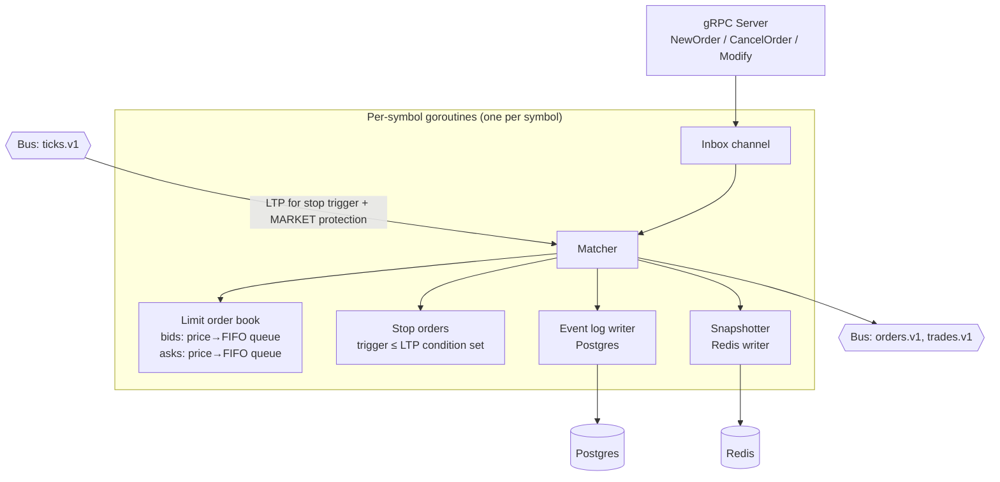

# Phase 2 — Matching Engine

**Weeks 3–4 · ~40 hrs**

Goal: your own CLOB matching engine, fed by synthetic market makers seeded from real L5 depth. This is the architectural centerpiece — most of your interview credibility comes from here.

## Prerequisites

- Phase 1 complete (ticks flowing).
- Read [05-nse-domain-primer.md](../05-nse-domain-primer.md) — order types, tick/lot, circuit filters, freeze qty.

## Deliverables

- `services/go/matching` accepts orders over gRPC, matches them, emits events to bus.
- Order types: LIMIT, MARKET (price-protected), IOC, FOK, SL, SL-M.
- Price-time priority with partial fills and self-trade prevention.
- Tick-size and lot-size validation (via contract master cache).
- Per-symbol actor (goroutine) owning a single book; no cross-symbol locking.
- Synthetic market makers quoting layered prices around LTP with configurable spread/skew.
- Redis book snapshots every 50 ms; FE can fetch L5 depth.
- Event log → deterministic recovery on boot.
- Golden-file tests for 15+ scenarios.
- k6 load test sustaining 10k orders/min locally, p99 ack < 50 ms.
- ADRs: `0006-per-symbol-actor`, `0007-order-book-datastructure`.
- Talking-points doc.

## Architecture (inside matching)




## Core design decisions

### 1. Single-writer per symbol

- Each symbol → one goroutine → owns the book. No locks inside the book.
- Input: unbounded channel with orders + LTP updates. Fair scheduling via Go runtime.
- Lets you reason about ordering trivially, guarantees determinism in replay.

### 2. Book data structure

- **Price → FIFO queue of orders** (doubly-linked list for O(1) remove on cancel).
- **Two sorted structures** for best-bid/best-ask traversal:
  - Option A: `skiplist` (ordered map) keyed by price — O(log N) best + insert + remove.
  - Option B: `treap` or `red-black tree`.
  - Option C: **array-indexed ladder** — price → index via `(price - floor)/tick`; O(1) operations but only feasible for narrow price ranges; good for options on same strike band.
- v1: skiplist (simple, predictable). Interview-note the O(1) ladder alternative for options.

### 3. Event sourcing

- Every mutation produces an event: `OrderAdded`, `OrderCancelled`, `OrderMatched`, `StopTriggered`, `BookCleared`.
- Events written to `oms.order_events` (by OMS) and a matching-engine-specific `match.events` stream.
- On boot: scan `match.events` since last snapshot → reconstruct book.

### 4. Snapshots

- Every 1 s *or* every 100 events, whichever first: snapshot best 20 levels both sides to Redis key `book:{symbol}`.
- Full book snapshot to Postgres every 1 min (for recovery).

## Tasks

### 2.1 Protobuf service

`packages/protos/services/matching.proto`:

```proto
service Matching {
  rpc NewOrder(NewOrderRequest) returns (Ack);
  rpc CancelOrder(CancelOrderRequest) returns (Ack);
  rpc ModifyOrder(ModifyOrderRequest) returns (Ack);
  rpc GetBook(GetBookRequest) returns (BookSnapshot);
}
```

### 2.2 Book primitives

- `PriceLevel { price numeric; qty int; orders []*Order }` with `AddOrder`, `RemoveOrder`, `PopFirst`.
- `Book { bids *skiplist; asks *skiplist; stops map[OrderID]*Order }`.
- `BestBid()`, `BestAsk()`, `BBO()`.

### 2.3 Matcher

Algorithm (simplified LIMIT buy):

```pseudo
while buyOrder.remaining > 0 && askBest exists && buyOrder.price >= askBest.price:
  if buyOrder.user == askBest.headOrder.user: skip (self-trade prevention)
  fillQty = min(buyOrder.remaining, askBest.headOrder.remaining)
  fillPx = askBest.price  # taker crosses; price is resting side
  emit Trade{...}
  update both orders
  if askBest.headOrder.remaining == 0: popFirst; if empty level: removeLevel
if buyOrder.remaining > 0 && order_type == LIMIT: book it
if buyOrder.remaining > 0 && order_type == IOC: cancel remainder
if buyOrder.remaining > 0 && order_type == FOK: abort (no partials)
```

MARKET: same but uses `+∞` as limit, with **price protection band** (reject if best ask > LTP × (1 + band%)); NSE default ~10%.

### 2.4 Stop / SL orders

- On each LTP update, evaluate pending stop orders: if LTP crosses trigger, promote to LIMIT (SL) or MARKET (SL-M) and enter matcher.
- Keep stops in a separate set keyed by `trigger_price` so eval is O(k) where k = stops crossed.

### 2.5 Self-trade prevention

- Before matching a taker vs. resting, if same `user_id` on both sides: per config either **cancel-newest**, **cancel-oldest**, or **decrement-and-cancel** (DC). NSE uses DC. Implement DC.

### 2.6 Validation (thin layer before matcher)

- Tick size: `price % tick_size == 0`.
- Lot size: `qty % lot_size == 0`.
- Freeze qty: `qty <= freeze_qty`.
- Price band: reject if `price > ub || price < lb` (from daily circuit file).
- These rejections emit `OrderRejected` with codes matching Kite's taxonomy (see Phase 3).

### 2.7 Synthetic market makers (`services/go/mm`)

- Input: LTP + L5 depth from MD bus.
- Quotes: N levels each side, e.g., 5 levels at ticks `1..5` away, qty drawn from `Poisson(lambda)`.
- Reseed every tick; cancel stale quotes.
- Configurable per symbol:
  - `spread_ticks`: base spread.
  - `skew`: bid/ask imbalance.
  - `depth_multiplier`: scales qty.
  - `refresh_ms`: re-quote rate (default 500ms).
- MM orders use a reserved `user_id='SYSTEM_MM'` (never appears in positions projection).

### 2.8 Snapshots & recovery

- Redis: `ZADD book:{symbol}:bids <price> <qty>` per level (price negated for descending ZSET).
- Periodic `SAVE` on shutdown signal.
- Recovery sequence: load latest full snapshot → replay events after snapshot seq → resume channel.

### 2.9 Circuit breaker (market-wide)

- Subscribe to `market.flags` stream; when `halted=true` arrives:
  - Pause all per-symbol matchers (drain channel to a side-queue).
  - Reject new orders with `MARKET_HALTED`.
  - Resume when flag clears.

### 2.10 Observability

- Histograms: `match_order_ack_ms`, `match_match_duration_ms`.
- Counters: `match_orders_total{type,status}`, `match_rejections_total{reason}`.
- Gauges: `match_book_depth{symbol,side}`, `match_queue_depth{symbol}`.

## Golden-file test scenarios (at minimum)

Each scenario = `.orders.jsonl` input + `.trades.jsonl` + `.events.jsonl` expected.

1. Empty book + LIMIT buy → book entry, no trade.
2. Crossing LIMIT → full fill.
3. LIMIT + multiple resting at same price → FIFO fill.
4. Partial fill across multiple levels.
5. IOC partial → leftover cancelled.
6. FOK cannot fully fill → reject with no trade.
7. MARKET walks book until protection band → partial fill + rejection reason.
8. SL trigger on LTP update → conversion to LIMIT.
9. SL-M trigger → MARKET with protection.
10. Self-trade prevention cancels taker side.
11. Cancel on a resting LIMIT → removed from book.
12. Modify price on resting LIMIT → priority reset (lose time priority).
13. Modify qty down on resting → same priority (Indian convention).
14. Tick-size violation → reject.
15. Freeze qty violation → reject.

## Performance targets

- p99 order-ack (NewOrder → Ack) < 20 ms on laptop at 10k/min sustained.
- Book fetch from Redis < 5 ms.
- Recovery from event log: 10k events replayed in < 5 s.
- GC pause p99 < 10 ms (tune `GOGC`, use `sync.Pool` for order structs).

## Common pitfalls

- Forgetting **price-level FIFO** on partial fills (new orders must go to tail).
- Allowing matching inside the same actor's **LTP-update handler** (deadlock if LTP update also triggers stop → match → LTP → ...). Use a single event loop per symbol, one event at a time.
- Cancelling while matching: process from snapshot of resting head, not live pointer.
- Modify semantics mismatch: Indian convention is "price change loses priority, qty down keeps priority, qty up loses".
- Floating-point for price: **don't**. Use `int64` = price in paise (₹ × 100) or use `decimal` throughout.
- MM flooding: when MD reconnects, your MM may submit a barrage. Throttle at `mm` service.

## Interview talking points

- Single-writer principle and why locks are the wrong default here.
- Price-time priority vs. pro-rata (NSE is price-time; CME futures use pro-rata on some contracts).
- Trade-offs of skiplist vs. array-indexed ladder.
- Self-trade prevention semantics — DC vs. CN vs. CO.
- Order-level vs. aggregated book — why aggregated levels are sufficient at NSE tick granularity.
- Why MMs are synthetic (didn't want to replay real order-book deltas — sourcing is hard and licensing is paid).
- Recovery story: event log as source of truth, snapshot as optimization.

## Resources

- ⭐ *Trading and Exchanges* — Larry Harris, ch. 4 (order types), 5 (order-driven markets).
- LMAX Disruptor paper: [https://lmax-exchange.github.io/disruptor/disruptor.html](https://lmax-exchange.github.io/disruptor/disruptor.html)
- `https://github.com/i25959341/orderbook` — Go reference (~500 LOC, readable).
- `https://github.com/enewhuis/liquibook` — C++ reference, clean headers.
- NSE Circulars on order-type rules (e.g., SL-M restrictions).
- Jane Street — "The Design of a Matching Engine" (talks on YouTube, various).

## Exit checklist

- All 15 golden-file scenarios pass.
- k6 sustained 10k orders/min, p99 < 50 ms ack.
- You can open the FE depth widget (Phase 5 placeholder) and see the book move against synthetic MM activity.
- Crashing the matching container mid-test → restart → book is intact from event log.
- Two ADRs written.

