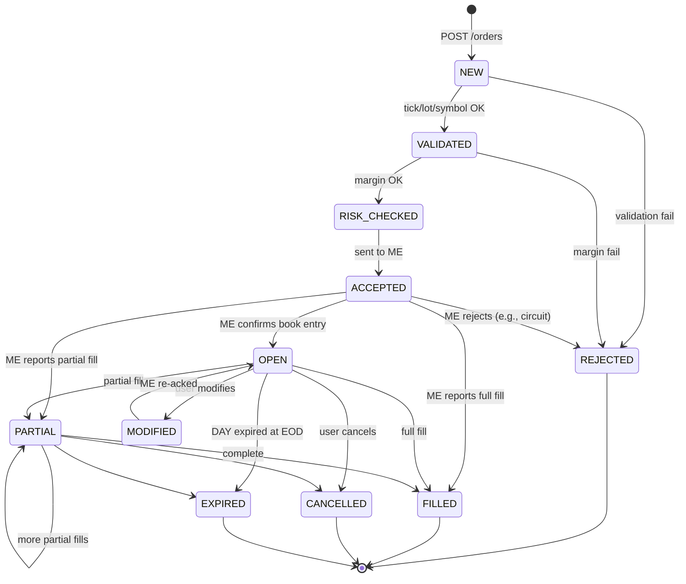
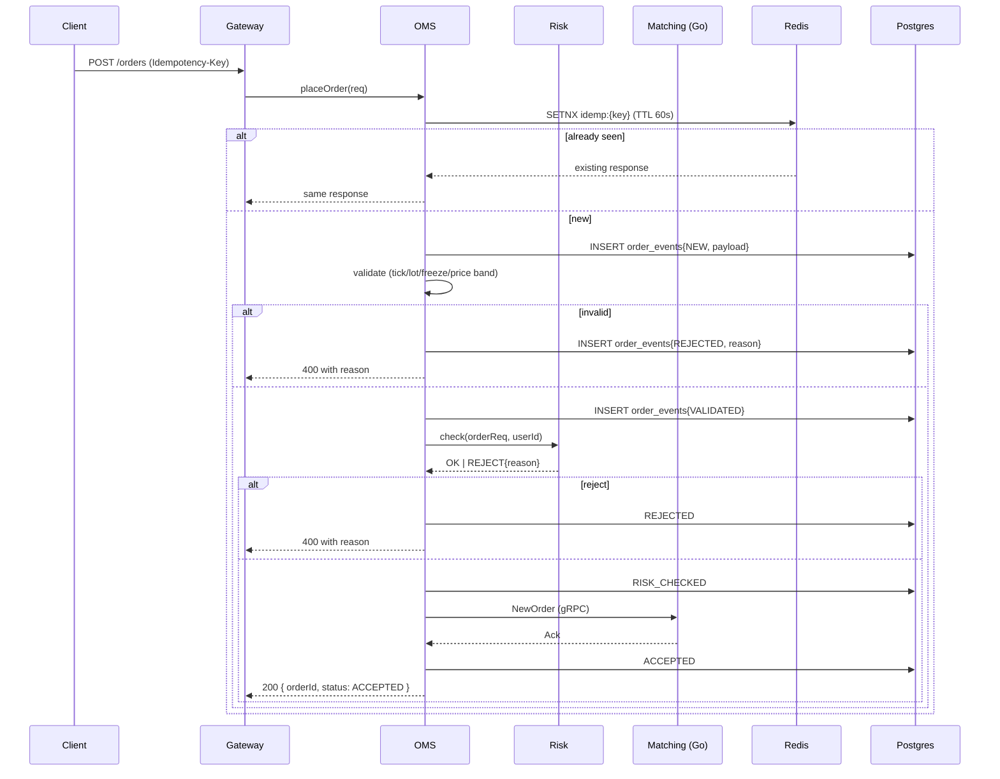

# Phase 3 — OMS + Pre-trade Risk (Equity module)

**Week 5 · ~20 hrs**

Goal: a real broker-grade OMS — event-sourced, idempotent, with state-machine guarantees — plus a pre-trade risk orchestrator that blocks over-leveraged orders.

Equity cash is the **first asset module**: validation + risk checks are implemented for `assetClass=EQUITY` / `segment=NSE_EQ`. NSE F&O is added later as a separate module (Phase 6–8) without changing OMS fundamentals.

## Prerequisites

- Phase 2 (matching engine) complete.
- Portfolio stub exists (even returning empty positions is fine — Phase 4 fleshes out).

## Deliverables

- `services/oms` exposes `POST /orders`, `DELETE /orders/:id`, `PATCH /orders/:id`, `GET /orders?status=...`.
- Full order state machine enforced; illegal transitions rejected.
- `oms.order_events` append-only log = source of truth.
- Idempotency via `Idempotency-Key` header (Redis + DB).
- Pre-trade risk checks via `services/risk` which **delegates to the asset module** (Equity now; NFO later); rejections carry structured reason codes.
- Reject-reason taxonomy documented in `docs/reject-reasons.md`.
- Drop-copy stream (`oms.drop_copy.v1`) emits every order + trade event for surveillance consumers.
- Rate limiting per user (50 orders/min).
- OTR (order-to-trade-ratio) tracked per user per symbol per day.
- ADR-0002 (event-sourced OMS) written. ADR-0008 (reject-reason taxonomy).
- Talking-points doc.

## Order state machine

Enforce via pure function `next(state, event) -> state | error`. Tests cover every transition.

## Place-order flow

Note: client gets 200 on *accepted into ME*, not *filled*. Fill is a push event.

## Tasks

### 3.1 Event log + projections

- `oms.order_events` table (schema in [03-data-model.md](../03-data-model.md)).
- Projection writer: on every event, update `oms.orders` row (`INSERT ... ON CONFLICT UPDATE` keyed on `order_id`).
- Read queries always hit the projection.
- Rebuild CLI: `pt admin rebuild orders --user=<id>` — walks events, recomputes projection, diffs.

### 3.2 Validation

- Pure function `validate(req, instrument) -> Result`.
- Checks: tick size, lot size, freeze qty, price band (from Phase 2 reference data), instrument status (ACTIVE), segment open.
- Unit tests with table-driven cases.

### 3.3 Risk orchestrator

- `services/risk` exposes `POST /check` with `{ userId, orderReq }`.
- v1 equity cash rules (Equity module):
  - For BUY CNC: require cash ≥ (qty × price) + est. charges.
  - For BUY MIS intraday: require `VAR% × notional` (VAR from NSE's daily file, default 20% if missing).
  - For SELL CNC: require holdings ≥ qty (no short delivery).
  - For SELL MIS: same intraday margin as BUY.
- For NFO (later module): Phase 6 may start with a placeholder margin rule, but the interface is the same and Phase 8 swaps in SPAN+Exposure behind the module boundary.
- Calls portfolio service for current cash/holdings; caches user snapshot in Redis with 100 ms TTL.
- Returns structured result with `marginBlocked` so OMS can post it.

### 3.4 Reject reason taxonomy

Document codes (flat namespace). Examples:

| Code                             | HTTP | Meaning                        |
| -------------------------------- | ---- | ------------------------------ |
| `VALIDATION_TICK_SIZE`           | 400  | Price not aligned to tick      |
| `VALIDATION_LOT_SIZE`            | 400  | Qty not multiple of lot        |
| `VALIDATION_FREEZE_QTY`          | 400  | Exceeds freeze                 |
| `VALIDATION_PRICE_BAND`          | 400  | Outside circuit filter         |
| `VALIDATION_INSTRUMENT_INACTIVE` | 400  | Symbol suspended/expired       |
| `RISK_INSUFFICIENT_FUNDS`        | 403  | Cash < required                |
| `RISK_INSUFFICIENT_HOLDINGS`     | 403  | SELL CNC without holdings      |
| `RISK_MARGIN_EXCEEDED`           | 403  | F&O SPAN+Exposure insufficient |
| `RISK_POSITION_LIMIT`            | 403  | Client-level position cap      |
| `RISK_MWPL_EXCEEDED`             | 403  | Market-wide position limit     |
| `RATE_LIMITED`                   | 429  | Too many orders                |
| `IDEMPOTENCY_KEY_MISMATCH`       | 409  | Same key, different payload    |
| `MARKET_CLOSED`                  | 409  | Segment not open               |
| `MARKET_HALTED`                  | 409  | MWCB triggered                 |
| `MATCHING_UNAVAILABLE`           | 503  | ME down                        |
| `ORDER_NOT_FOUND`                | 404  | Cancel/modify on unknown order |
| `ILLEGAL_STATE_TRANSITION`       | 409  | Modify FILLED order, etc.      |

Every reject logs the code + context + user_id. FE maps to a human sentence.

### 3.5 Cancel / modify

- Cancel: emit `CANCEL_REQUESTED`; forward to ME; on ME ack, emit `CANCELLED`.
- Modify (price or qty):
  - If only qty **down** and order is OPEN/PARTIAL: same priority (Indian convention).
  - Otherwise: cancel-and-replace (ME-side).
- Guard against modifying terminal states.

### 3.6 Idempotency

- Header: `Idempotency-Key: <client ULID>`.
- Redis key `idemp:{user}:{key}` stores response JSON with TTL 60 s.
- Also persisted as `client_order_id` on `oms.orders` with `(user_id, client_order_id)` unique index.
- If same key, different payload → 409 `IDEMPOTENCY_KEY_MISMATCH`.

### 3.7 Rate limiting

- Token bucket in Redis (`INCR` with TTL window).
- 50 orders/min default; override per user via `ref.users.rate_limit`.
- Exceed → 429 `RATE_LIMITED`, `Retry-After` header.

### 3.8 Drop-copy stream

- Every terminal event (`ACCEPTED`, `REJECTED`, `FILLED`, `CANCELLED`, plus every `Trade`) also publishes to `oms.drop_copy.v1`.
- Consumers: surveillance (OTR tracker), audit archiver (Phase 11 cold-storage job).
- Mirrors how a real broker sends drop-copy to compliance / back-office.

### 3.9 OTR surveillance (thin)

- Consumer on `oms.drop_copy.v1`: increments counters keyed `(user, symbol, date)`.
- Metric `order_to_trade_ratio{user}` gauge = orders / trades.
- Warning log at OTR > 50; doesn't block (v1).

## Metrics to track

- `orders_placed_total{product,side,type}`
- `orders_rejected_total{reason}`
- `order_ack_latency_ms_bucket` (GW → OMS ack)
- `risk_check_duration_ms`
- `orders_in_flight_gauge`
- `otr_gauge{user}`
- `idempotency_replays_total`

## Performance targets

- p99 `POST /orders` (full path, not counting ME match) < 80 ms.
- `POST /risk/check` p99 < 30 ms.
- Sustain 5k orders/min/user without HTTP 5xx.

## Testing

- Unit: state machine (every transition), validation functions, reject-reason mapper.
- Integration: Testcontainers PG+Redis, mock ME client → end-to-end place/cancel/modify.
- Property: idempotency — same request 1000× → exactly one order inserted.
- Chaos: ME unreachable → 503; ME flaky → retry budget respected; no double submit.

## Common pitfalls

- Forgetting to persist `NEW` **before** any outward call. Losing the fact that the user hit "submit" is unacceptable.
- Treating OMS `orders` projection as source of truth and mutating it directly — no. Only project from events.
- Race: modify arrives while partial fill is in flight. Serialize per `order_id` (mutex or per-order queue).
- Idempotency on `DELETE` / `PATCH` — same pattern, different key semantic.
- Keeping idempotency window too long (cost) or too short (retries miss). 60 s is a sweet spot.
- Rate-limiting IPs instead of users — meaningless when v2 goes multi-tenant.

## Interview talking points

- Idempotency is a **contract with the client**, not a DB trick.
- Event sourcing vs. state-based persistence; when *not* to use event sourcing.
- Reject-reason taxonomy as a UX and ops investment — error codes get read in production every day.
- Sync pre-trade risk vs. async post-trade — why SEBI peak-margin forces sync.
- Drop-copy vs. trade-confirmation — different consumer shape, same source.
- Multi-writer scaling: per-order serialization → shard by hash(order_id).
- Circuit patterns: when ME is down, do we queue or reject? (v1: reject; v2: discuss durable queue.)

## Resources

- ⭐ Kite Connect v3 docs — order API shape, error codes: [https://kite.trade/docs/connect/v3/orders/](https://kite.trade/docs/connect/v3/orders/)
- Stripe engineering blog: "Designing robust and predictable APIs with idempotency."
- Martin Fowler — Event Sourcing.
- SEBI circular on peak margin (2020/21 series).
- [*Enterprise Integration Patterns*] — idempotent receiver, message store.

## Exit checklist

- You can place, cancel, modify orders via curl and see events in Postgres.
- Repeating a request with the same idempotency key returns the same response.
- A BUY CNC order without cash is rejected with `RISK_INSUFFICIENT_FUNDS`.
- `oms.drop_copy.v1` has entries a surveillance consumer can tail.
- ADR-0002 and ADR-0008 merged.
- `docs/reject-reasons.md` published.

