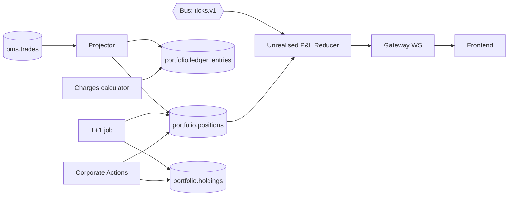

# Phase 4 — Positions, P&L, Ledger

**Week 6 · ~20 hrs**

Goal: live positions, holdings (T+1 transition), realised & unrealised P&L, and a double-entry ledger. This is where the system "feels real" — you see your paper money move.

## Prerequisites

- Phase 3 OMS emitting `Trade` events on the bus.
- MD streaming LTP for positions' instruments.

## Deliverables

- [ ] `services/portfolio` projects `portfolio.positions` from `oms.trades` in real time.
- [ ] Product types modelled: MIS, CNC, NRML.
- [ ] Position conversion API: `POST /positions/:id/convert { to: "CNC"|"NRML" }`.
- [ ] Unrealised P&L computed on each LTP tick (in-memory reducer, streamed to FE via gateway).
- [ ] Realised P&L on every fill (FIFO lot-level).
- [ ] Double-entry ledger: every trade, charge, MTM writes paired entries.
- [ ] Holdings page: lot-wise CNC holdings with acquisition date.
- [ ] Daily intraday square-off job marks MIS → closed at 15:15 (scheduler stub; wired fully in Phase 10).
- [ ] `/positions`, `/holdings`, `/funds` endpoints.
- [ ] Projection rebuild CLI: `pt admin rebuild positions`.
- [ ] ADR-0009 (projections as derived state).
- [ ] Talking-points doc.

## Conceptual model

## Projections

### `positions` projection

Keyed `(user_id, instrument_id, product)`:

- On BUY trade: `net_qty += qty`. Update `avg_price` via weighted average for adds (qty × price); for partial close or flip, see below.
- On SELL trade with net_qty > 0 (closing long): realise P&L on the reduced portion; leave `avg_price` unchanged for remainder.
- If sell exceeds long qty → remainder becomes short with new `avg_price`.
- Symmetric for shorts (only applicable to F&O; equity MIS allows short intraday only).

Implementation: replay safe (idempotent by `trade_id` — record last processed trade per position).

### `holdings` projection

- At T+1 EOD job: for each user, take all `positions` with `product='CNC'` and `net_qty > 0`.
- Create lot-wise rows in `holdings` with `acquired_on = T`.
- Zero out the CNC position row.

### Lot-wise FIFO

- Holdings table stores lots individually (one row per acquisition event batch).
- On SELL CNC: consume oldest lots first; compute cost basis + LTCG/STCG flag (`acquired_on + 365 days < sell_date`).

### Position conversion

- MIS → CNC: requires full cash; risk re-check; if OK, move qty from MIS row to CNC row at same avg_price; ledger entry moves margin from MARGIN_BLOCKED to CASH-reserved.
- MIS → NRML (for F&O, after Phase 6): SPAN re-check.
- CNC → MIS: allowed intraday only; releases cash into MARGIN_BLOCKED.

## Ledger (double-entry)

Accounts: `CASH`, `MARGIN_BLOCKED`, `MTM_REALISED`, `MTM_UNREALISED` (computed, not stored), `CHARGES`.

Example: BUY CNC 10 × INFY @ 1500:

- Outbound: debit `MARGIN_BLOCKED` 15000, credit `CASH` 15000 (on place).
- On fill: debit `CASH` (charges), credit `CHARGES`.
- No ledger entry for the position itself — positions are a separate projection.

Example: MIS BUY + intraday close (profit 100):

- On place: debit `MARGIN_BLOCKED` (VAR×notional), credit `CASH`.
- On close trade: credit `MARGIN_BLOCKED`, debit `CASH` (release); + debit `CASH` 100 (profit), credit `MTM_REALISED` 100.

Invariant: `Σ debits == Σ credits` per user per day (asserted by test).

## Tasks

### 4.1 Projector

- Consumes `trades.v1` with consumer group `portfolio-projector`.
- For each trade: update position, write ledger entries, publish `PositionUpdated` event.
- Idempotent: before writing, check `trade_id` not already processed for this position (`last_trade_id` field).

### 4.2 Unrealised P&L reducer

- Consumes `ticks.v1` (only LTP).
- In-memory: `map[(user, instrument, product)] -> netQty + avgPx`.
- On each tick: `uPnL = netQty × (ltp - avgPx)`.
- Pushes `PositionUpdated` diffs at 500 ms throttle per user (don't flood FE with every tick).

### 4.3 Charges calculator

- `packages/quant/charges.ts` computes brokerage, STT, exchange, SEBI, stamp, GST per trade (see [05-nse-domain-primer.md](../05-nse-domain-primer.md) table).
- On fill → emit charge → ledger writes.

### 4.4 Holdings + T+1

- Cron job (stub now; wired into scheduler in Phase 10) at 00:00 IST next trading day:
  - For each CNC position with net_qty > 0: create holdings lot with `acquired_on = trade_date`.
  - Zero out `portfolio.positions` CNC rows.
  - Emit `HoldingsUpdated`.

### 4.5 Intraday square-off (MIS)

- At 15:15 IST (for equity), 15:25 (for F&O):
  - For each MIS position with net_qty != 0: place MARKET order to flatten.
  - Tag order `system=true, reason=MIS_AUTO_SQUAREOFF`.
- Actual scheduler wiring in Phase 10; v1 can be a CLI: `pt admin squareoff --user=<id>`.

### 4.6 APIs

- `GET /positions` → live positions with uPnL.
- `GET /holdings` → lot-wise.
- `GET /funds` → cash + margin blocked + MTM day + available.
- `POST /positions/:id/convert { to }`.
- `GET /pnl?from=&to=` → aggregated realised over period.

### 4.7 WS stream

- Gateway exposes `/ws` with channel `positions:<userId>` — push diffs.

### 4.8 Tests

- Projection replay: take fixture trade log, rebuild from scratch, assert final `positions` and `ledger` match expected.
- Ledger invariant test across generated trade sequences.
- FIFO lot matching test: multi-day acquisitions, partial sell, assert STCG vs. LTCG split.
- Concurrency: 1000 concurrent buys on same symbol → positions converge correctly.

## Metrics

- `positions_updates_total{source}`
- `positions_reconcile_diff_total` (CI-only)
- `upnl_reducer_lag_ms`
- `ledger_invariant_failures_total` (should always be 0; alert on > 0)

## Performance targets

- `GET /positions` p99 < 50 ms for 100 positions.
- Trade → position update visible on FE WS p99 < 300 ms.
- Rebuild 1M trades in < 60 s.

## Common pitfalls

- Averaging prices across reduces — only *adds* update avg_price.
- Short positions need separate handling (avg_price direction).
- Ledger floating-point drift — use `numeric(18,4)`, never `float`.
- Running the rebuild CLI while live projector is writing → locking. Use advisory lock `pg_advisory_lock(hash('positions_rebuild'))`.
- Not debouncing uPnL pushes to FE → browser stutter.
- Forgetting corporate-action adjustments to `avg_price` and `qty` post-split/bonus.

## Interview talking points

- Derived state vs. stored state; when to keep a projection, when to compute on read.
- Double-entry ledger: the one abstraction that scales from paper trader to bank.
- Why uPnL is computed, not stored.
- Idempotent projector design — why `last_trade_id` on the projection row beats a side table.
- Position conversion as a state transition that spans two writers (Portfolio + Risk) — how do you avoid double-margin?
- FIFO vs. WAC cost basis — which does Indian tax regime demand? (FIFO for demat equity.)

## Resources

- Zerodha Varsity Module 7 — Markets & Taxation (STCG/LTCG, intraday speculative, F&O non-speculative).
- *Accounting for Value* — Stephen Penman (ledger mental model).
- Kite Connect docs on `positions`, `holdings`, `margins` endpoints — mimic their API shape.
- CDSL/NSDL "Demat FAQ" for T+1 mechanics.

## Exit checklist

- [ ] Place a buy, see position appear, watch uPnL tick live.
- [ ] Sell partially, see realised P&L accrete; avg_price of remaining long unchanged.
- [ ] Run `pt admin rebuild positions` → zero diff against projection.
- [ ] Ledger sum of debits == credits for today.
- [ ] ADR-0009 merged.
