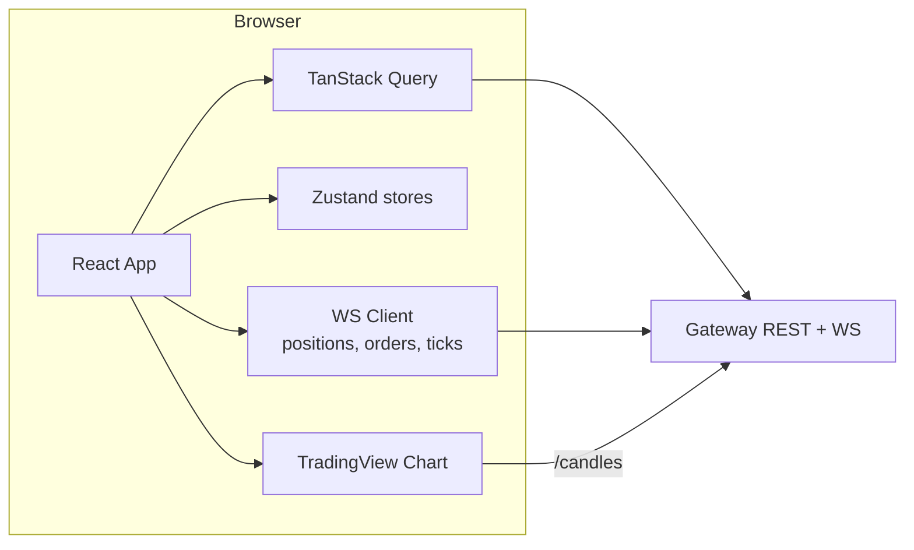

# Phase 5 — Frontend v1 (Kite-clone)

**Weeks 7–8 · ~40 hrs**

Goal: a web app that *feels* like Kite / Angel One. The user logs in (stub), sees a watchlist, opens a chart, places an order, and sees positions update live.

## Prerequisites

- Phases 1–4 complete.
- Gateway exposes REST + WS; OMS, MD, Portfolio all reachable through it.
- You've signed TradingView's charting_library agreement (free) and downloaded the library.

## Deliverables

- [ ] App shell: navbar, sidebar, active-session indicator.
- [ ] Watchlist: 5 tabs, drag-to-reorder within tab, add/remove symbols.
- [ ] L5 market depth panel (live).
- [ ] TradingView chart integrated with your candle API (1m/5m/15m/1h/1d intervals).
- [ ] Order pad modal: LIMIT/MARKET/SL/SL-M, product MIS/CNC/NRML, validity DAY/IOC, margin preview.
- [ ] Positions page: open positions, live uPnL, close button.
- [ ] Holdings page: lot-wise with LTCG/STCG tag.
- [ ] Orders page: open/executed tabs, cancel/modify actions.
- [ ] Funds page: cash, margin blocked, available.
- [ ] Option chain page (basic; greeks come in Phase 7).
- [ ] Global WS connection with auto-reconnect, exponential backoff.
- [ ] Keyboard shortcuts: `B` buy, `S` sell, `/` search, `Esc` close modal.
- [ ] Dark mode.
- [ ] Error boundary + toast system with retry-aware UX.
- [ ] Mobile-responsive down to 768px (not pixel-perfect, but usable).
- [ ] ADR-0010 (FE state management choice).
- [ ] Talking-points doc.

## Architecture

### State split

- **Server state** (TanStack Query): instruments, orders history, holdings, reports.
- **Real-time state** (WS → Zustand): live ticks (subscribed symbols), live positions, live orders, live book depth.
- **UI state** (Zustand): watchlist active tab, selected symbol, open modals, theme.
- **Form state** (react-hook-form): order pad, settings.

## Key components

### Watchlist

- Virtualized list (`@tanstack/react-virtual`) if > 50 items.
- Row shows: symbol, LTP, change %, bid, ask, volume.
- Colors: green-tick / red-tick briefly on LTP change (decays in 400 ms).
- Right-click / long-press → context menu (buy, sell, chart, add to another list).

### Market depth

- Two columns of 5 rows (bids | asks).
- Each row: orders count, qty, price.
- Background bar visualizing qty ratio at level.
- Subscribed on panel mount, unsubscribed on unmount.

### Chart

- TradingView `charting_library` with custom datafeed implementing `getBars`, `subscribeBars`.
- `getBars` → `GET /candles`.
- `subscribeBars` → WS tick → aggregate client-side into the current bar.
- Drawing tools enabled; studies (SMA, EMA, RSI) enabled.

### Order pad

- Fields with live validation:
  - Qty (must be multiple of lot_size; show lot_size hint).
  - Price (must align to tick_size).
  - Trigger (if SL/SL-M).
  - Product / Validity / Order Type toggles.
- **Margin preview**: calls `POST /risk/preview` with the draft order; the backend delegates to the relevant asset module RiskModel (Equity now, NFO later) and returns required margin + breakdown.
- **Charges preview**: calls `POST /charges/preview` for STT/brokerage/GST breakdown.
- Submit → `POST /orders` with Idempotency-Key = ULID. Button disabled until response.
- Optimistic "ORDER_ACCEPTED" toast; updates when OMS push confirms OPEN/PARTIAL/FILLED/REJECTED.

### Option chain

- Grid: rows = strikes, columns split CE / PE; center column = strike.
- Columns: OI, Chg in OI, Volume, IV (Phase 7), LTP, Bid, Ask, Delta (Phase 7).
- Click any cell → open pre-filled order pad for that option.
- Strike highlight for ATM.

### Positions

- Live table; uPnL updates from WS.
- Actions: close (MARKET order to flatten), convert (MIS↔CNC/NRML).
- Total day P&L header (realised + unrealised).

### Holdings

- Lot-wise rows grouped by symbol; expandable to show individual acquisitions.
- LTCG tag if `acquired_on + 365 < today`.

### Orders

- Tabs: Open / Executed / All.
- Each row: time, symbol, side, qty, price, status.
- Cancel / Modify inline for Open orders.
- Clicking an order opens detail drawer with full event log (from `oms.order_events`).

### Funds

- Cash, Margin Blocked, Unrealised MTM, Available.
- "Add virtual funds" button (v1 convenience; stub endpoint on OMS that just credits CASH).

## Tasks

### 5.1 Scaffold

- `pnpm create vite apps/web --template react-ts`.
- Tailwind + shadcn/ui init.
- Routing: TanStack Router with typed routes.
- Axios or fetch wrapper with auth-header injection (stub) and trace-id propagation.

### 5.2 WS client

- Single connection per user; multiplexed channels.
- Auto-reconnect with backoff; resubscribe state on reconnect.
- Subscription manager: `subscribe('depth', symbol)` → ref-counted; unsubscribe on last consumer gone.

### 5.3 Component library

- Build reusable primitives in `packages/ui`: `Table`, `Card`, `Modal`, `Tabs`, `NumericInput`, `PriceCell`.

### 5.4 TradingView integration

- Copy `charting_library/` into `apps/web/public/` (per license).
- Implement custom datafeed adapter `TVDatafeed.ts`.
- Handle time-zone: all timestamps in Asia/Kolkata.

### 5.5 Error & empty states

- Every table has loading, empty, error states.
- Global toast for API errors mapped from reject-reason codes.

### 5.6 Accessibility basics

- Keyboard-navigable tables.
- ARIA labels on icon buttons.
- Focus trap in modals.

## Performance targets

- Time-to-interactive < 2 s on broadband.
- Watchlist rendering 100 symbols at 2 ticks/sec each: frame budget < 16 ms.
- Memory stable (no leak) over 1 hr live session.

## Testing

- Component tests (Vitest + React Testing Library) for order pad validation.
- Playwright E2E:
  - Place order flow → confirm in positions.
  - Cancel order flow.
- Visual regression (Chromatic or Playwright screenshots) for watchlist & depth.

## Common pitfalls

- Re-rendering the full watchlist on every tick — memoize row components; keyed on `instrument_id`.
- Depth widget flickering — animate level deltas, not wholesale re-renders.
- WS buffered messages overwhelming React state — throttle to one flush per animation frame.
- Timezone bugs — set TZ everywhere.
- Opening multiple WS connections (one per tab component) — route all through a single manager.
- Forgetting to unsubscribe on unmount → MD server bill for ghost subscriptions.

## Interview talking points

- FE state split philosophy: server vs. real-time vs. UI vs. form state.
- WS multiplexing + ref-counted subscriptions.
- Why TanStack Query over SWR / RTK Query for this shape of data.
- Chart integration trade-offs: build vs. buy (TradingView).
- Optimistic UI without lying to the user (order "ACCEPTED" vs. "FILLED" semantics).
- A11y in a trading UI: screen-reader support for P&L changes (live regions).

## Resources

- TradingView Charting Library: <https://www.tradingview.com/charting-library-docs/>
- shadcn/ui: <https://ui.shadcn.com>
- TanStack Query docs.
- Zustand docs.
- react-hook-form.
- Kite Web UI (for inspiration; study UX patterns).
- Dieter Rams / trading UI design talks on YouTube.

## Exit checklist

- [ ] Every page reachable from the sidebar works.
- [ ] You can place, cancel, modify orders from the UI.
- [ ] Chart loads live candles for NIFTY; ticks update last bar.
- [ ] Close the laptop for 10 min, reopen — WS reconnects cleanly, state resyncs.
- [ ] Lighthouse performance > 85 on desktop.
- [ ] ADR-0010 merged.
