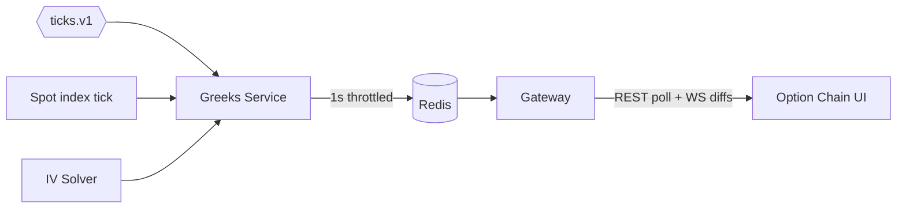

# Phase 7 — NSE F&O module: Options

**Weeks 10–11 · ~40 hrs**

Goal: add the **NSE F&O asset module** for options: full options lifecycle. Option chain with live greeks and IV, premium trading, expiry settlement with STT-on-exercise handled correctly, multi-leg composition on the FE (margin benefit comes in Phase 8).

## Prerequisites

- Phase 6 futures working.
- `packages/quant` set up (you may have stubbed it earlier — fleshes out here).

## Deliverables

- [ ] Contract master includes CE / PE for NIFTY, BANKNIFTY, FINNIFTY weekly + monthly; stock options monthly for top 10 F&O stocks.
- [ ] Black-Scholes pricer + greeks in `packages/quant` (Node; Go mirror for SPAN phase).
- [ ] Implied volatility solver (Newton-Raphson) — given LTP, solve for σ.
- [ ] Option chain UI page (rebuilt from Phase 5 stub) with live LTP, IV, OI, ChgOI, Volume, Delta for CE + PE per strike.
- [ ] Expiry settlement:
  - ITM: intrinsic value paid/received; STT on exercise applied (⚠ the famous trap).
  - OTM: premium loss (for buyer), premium profit (for seller).
- [ ] Multi-leg order composition UI (e.g., Bull Call Spread): places N orders as a group; all-or-none semantics at FE level (server-side atomicity is a v2 notion; document the gap).
- [ ] Interim option margin (NFO RiskModel): `premium × lot_size` for buyer; `initial_margin%` for seller. Phase 8 replaces seller margin with SPAN+Exposure.
- [ ] ADR-0012 (greeks computation server vs. client).
- [ ] Talking-points doc.

## Option math (`packages/quant`)

### Black-Scholes pricing

```
d1 = (ln(S/K) + (r + σ²/2) × T) / (σ × √T)
d2 = d1 - σ × √T
Call = S × N(d1) - K × e^(-rT) × N(d2)
Put  = K × e^(-rT) × N(-d2) - S × N(-d1)
```

Where `S` = spot, `K` = strike, `r` = risk-free rate (use 10Y G-Sec yield, ~7%), `T` = time to expiry in years, `σ` = annualized vol, `N` = standard normal CDF.

For Indian index options, **use forward price** `F = S × e^((r - q) × T)` if you need dividend-adjusted; for simplicity, assume `q=0` for indices.

### Greeks

- Delta = N(d1) for call; N(d1) − 1 for put.
- Gamma = φ(d1) / (S × σ × √T).
- Vega = S × φ(d1) × √T / 100 (per 1% vol).
- Theta = (-S × φ(d1) × σ / (2 × √T) − r × K × e^(-rT) × N(d2)) / 365 (per day).
- Rho = K × T × e^(-rT) × N(d2) / 100 (per 1% rate).

### IV solver

- Newton-Raphson: seed σ₀ = 0.3; iterate `σ ← σ - (BS(σ) - mktPrice) / Vega(σ)`.
- Bisection fallback if Newton diverges (rare but possible at deep OTM).
- Convergence tolerance 1e-4; cap iterations at 50.

## Option chain architecture



- Greeks service: subscribes to ticks for current-expiry options + underlying spot; recomputes greeks on each underlying tick (not every option tick) — keeps compute bounded.
- Cache: `greeks:{instrument_id}` with LTP, IV, delta, gamma, vega, theta.
- FE fetches chain snapshot on load, then WS diffs.

## Tasks

### 7.1 Contract master for options

- Extend sync to parse Angel's NFO OPT entries.
- Filter: current week, next week, current month, current quarter. Strikes ±10 from ATM.
- Background refresh: option chain expands when price moves (new ATM strikes).

### 7.2 Pricer + greeks + IV solver

- `packages/quant/black_scholes.ts` with typed functions.
- Test against known values (use published tables).
- Benchmark: full chain (100 strikes × 2 sides) greeks in < 10 ms.

### 7.3 Greeks service

- New Node service or module in `portfolio`. Choose: separate service `services/greeks` (cleaner). Subscribes ticks, writes to Redis, publishes `GreeksUpdated` event.
- 1s throttle per instrument to avoid thrashing.

### 7.4 FE option chain

- Grid component. Performance: only re-render cells whose LTP / greek changed.
- Row coloring: highlight ATM.
- Click on premium cell → open order pad pre-filled.
- Filters: expiry dropdown, strikes range (ATM ± N).

### 7.5 Multi-leg builder

- UI: "Strategy Builder" panel with presets (Bull Call Spread, Iron Condor, Straddle, Strangle).
- Compose N legs; show net premium, max profit, max loss, breakevens.
- Submit → N separate `POST /orders` with a shared `basket_id`.
- v1: if any leg rejects, leave others as-is (log warning). v2: compensate or atomic group at OMS.

### 7.6 Expiry settlement

- On expiry day EOD:
  - For each open option position:
    - Compute intrinsic = `max(S − K, 0)` for CE, `max(K − S, 0)` for PE, using final settlement price of underlying.
    - **Long CE ITM**: credit `intrinsic × lot × qty` to CASH; debit STT on exercise.
    - **Short CE ITM**: debit (loss). Counterpart to the long.
    - **Any OTM**: no cash flow; premium already realised on trade.
  - Mark contract `EXPIRED`; close position.
- ⚠ The STT-on-exercise trap: STT on ITM exercise is **0.125% of intrinsic** (not premium). A deep-ITM option bought at ₹1 and exercised on a ₹500 intrinsic pays ~₹0.625 STT — can exceed the premium. Document this in the ADR.

### 7.7 Reports

- P&L report extends to show option-segment P&L with "speculative" vs "non-speculative" tag (F&O is non-speculative per IT Act).

### 7.8 Surveillance

- Alert on exercise-STT > premium — the user has been bitten.

## Metrics

- `greeks_compute_duration_ms`
- `iv_solver_iterations_histogram`
- `option_chain_cache_hit_ratio`
- `expiry_settlements_total{moneyness}`

## Performance targets

- Full chain refresh on ATM tick < 50 ms.
- IV solve p99 < 500 μs (per contract).
- Option chain page first paint < 1.5 s.

## Testing

- Unit: BS values against published tables; IV round-trip (price → IV → price).
- Integration: simulated expiry day → assert ledger + positions after settlement.
- Property: put-call parity `C − P = S − K × e^(-rT)` holds within rounding in the pricer.
- Edge: at-expiry (T = 0) pricing → collapses to intrinsic.
- Chaos: vol spike 200% → IV solver still converges or returns graceful "no convergence" signal.

## Common pitfalls

- Using `T` in days instead of years.
- Using IST wall clock vs. trading-hour time — decision: use calendar days / 365 for simplicity in v1; ADR notes that "business time" variants exist (market-hours-only fractions).
- Ignoring bid-ask when computing IV — use mid-price; tell the user you did.
- Computing greeks on every option tick — recompute only on underlying change.
- STT-on-exercise not applied → your P&L looks too good.
- Forgetting that **option writers** post margin; buyers only pay premium.
- Not handling the case where underlying is itself a future (e.g., some commodity options) — not in v1 scope anyway.

## Interview talking points

- BS assumptions and where they break in Indian markets (lognormal returns — smile visible).
- Implied volatility as the market's disagreement with BS.
- Vol surface (smile, skew, term structure) — mention as known, not implemented.
- Multi-leg margin benefits (setup for Phase 8).
- Why greeks belong on the server (consistent across clients, one source of truth).
- Why you chose Newton-Raphson + bisection fallback.
- STT-on-exercise as a real-world edge case that hit many retail traders.

## Resources

- ⭐ Hull, chapters 15 (BS), 19 (greeks).
- Sensibull blog + "Options MBA" series.
- Zerodha Varsity Module 5 — Options Theory; Module 6 — Option Strategies.
- `espenhaug.com` — closed-form option formulas reference.
- NSE Option Chain (observe fields and update cadence).
- "Volatility and Correlation" — Rebonato (deep dive, optional).

## Exit checklist

- [ ] Option chain loads for NIFTY current expiry with live greeks.
- [ ] Can place a Bull Call Spread via Strategy Builder.
- [ ] On expiry simulation, ITM long profits, ITM short loses, STT applied.
- [ ] IV solver handles deep OTM gracefully.
- [ ] ADR-0012 merged.
