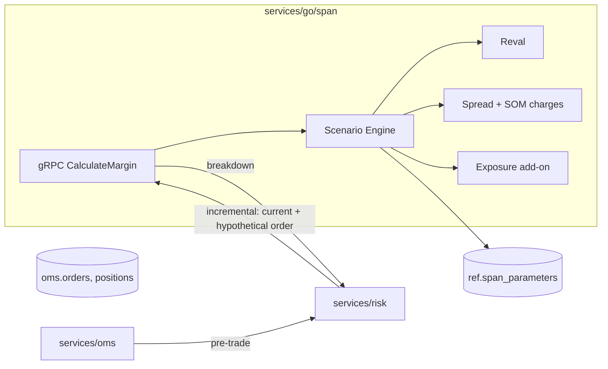

# Phase 8 — SPAN + Exposure Margin Engine

**Weeks 12–13 · ~40 hrs**

**This is your differentiator.** Most portfolio projects stop at "20% of notional". You're building real SPAN — the same framework CME and NSE Clearing use.

## Prerequisites

- Phases 0–7 complete.
- `packages/quant` has BS pricer + greeks.
- You've read the CME SPAN methodology PDF once end-to-end. Budget half a day.

## Deliverables

- [ ] `services/go/span` gRPC service: `CalculateMargin(PortfolioSnapshot) → MarginBreakdown`.
- [ ] Ingest NSE's daily **SPAN parameter file** into `ref.span_parameters` table.
- [ ] Full scenario engine: 16 standard scenarios (price scan × vol scan × extreme moves).
- [ ] Spread charges: intra-commodity (calendar) + inter-commodity.
- [ ] Short Option Minimum (SOM).
- [ ] Exposure margin layered on top.
- [ ] Risk orchestrator calls SPAN for every F&O order pre-trade (incremental).
- [ ] Margin statement report: per-user, per-underlying breakdown.
- [ ] Validation: reconcile your SPAN output against NSE's published margin files for known portfolios, within 1–2% tolerance (SPAN has minor version drift).
- [ ] ADRs: `0013-span-scenarios`, `0014-span-vs-var-for-equity`.
- [ ] Talking-points doc (long — interview gold).

## SPAN in one page

SPAN = **Standard Portfolio Analysis of Risk**. A scenario-based method originally built by CME in 1988, adopted globally including by NSE.

The idea: given a portfolio of F&O positions, what's the **worst-case daily loss** across a set of standardized market-move scenarios? That worst-case loss is the Scanning Risk. Add charges for residual risks (spreads, short options, extreme moves). Add Exposure on top.

### The 16 (or so) scenarios

A typical SPAN grid has:

- **Price scans**: {-3σ, -2σ, -σ, 0, +σ, +2σ, +3σ} — 7 moves.
- **Volatility scans**: {-vol_shift, +vol_shift} — 2 moves.
- **Combined**: each price × each vol direction for the "standard" 14 scenarios.
- **Extreme moves**: +200% / -200% of the price scan range, weighted at 32% (the idea: tail events, partial credit). 2 more scenarios.

For each scenario, revalue every contract in the portfolio (BS for options, linear for futures). Sum P&L per scenario. Worst loss = **Scanning Risk**.

### Charges beyond scanning

- **Intra-commodity spread charge**: long near-month offsets short far-month perfectly in scanning, but they're not *really* perfectly hedged (basis risk). Add a small charge per spread quantity.
- **Inter-commodity spread credit**: long NIFTY offsets short BANKNIFTY *partially*. Apply correlation-based credit.
- **Short Option Minimum (SOM)**: floor on margin for short options positions to guard against naked shorts being underpriced.
- **Calendar spread charge**: variant of intra-commodity for options.

### Exposure margin

SEBI/NSE layer on top of SPAN: `~3% of contract value for index futures / ~5% for stock futures / variable for options`. Purpose: cushion beyond SPAN's scenario coverage.

### Total upfront margin

```
Total = SPAN (Scanning + Spread + SOM) + Exposure
```

## Architecture



## Data model additions

```sql
create table ref.span_parameters (
  underlying       text not null,
  as_of_date       date not null,
  price_scan_range numeric(10,4) not null,    -- % move, e.g., 0.06 for 6%
  vol_scan_up      numeric(10,4) not null,
  vol_scan_down    numeric(10,4) not null,
  extreme_move_pct numeric(10,4) not null,    -- typically 2x price_scan_range
  extreme_weight   numeric(10,4) not null,    -- e.g., 0.32
  som_per_short    numeric(18,4) not null,    -- short option minimum
  spread_charge    numeric(18,4) not null,    -- per spread qty
  exposure_pct     numeric(10,4) not null,
  correlations     jsonb,                     -- inter-commodity matrix
  primary key (underlying, as_of_date)
);
```

Seeded from NSE's daily SPAN parameter file.

## Tasks

### 8.1 Parse NSE SPAN parameter file

- Download from NSE Clearing (daily). Format is proprietary-ish — NSE publishes spec.
- Parser in Go under `services/go/span/parser/`.
- CLI: `pt span ingest --date=YYYY-MM-DD`.
- Store in `ref.span_parameters`.

### 8.2 Scenario engine

- Input: `Portfolio { positions: []Position }` where `Position { instrumentId, qty, avgPrice, isOption, strike, expiry, optionType }`.
- For each underlying in portfolio:
  - Load SPAN params for date.
  - Build scenarios (16).
  - For each scenario:
    - Shifted spot = `S × (1 + price_move)`.
    - Shifted vol = `IV × (1 + vol_move)`.
    - For each position on this underlying:
      - If future: `pnl = (shifted_spot - S) × qty × lot × signed_dir`. (Simplification: future ≈ spot for scenario purposes; in reality NSE uses its own future price scan.)
      - If option: reprice with BS(shifted_spot, shifted_vol, T, r, K, type); `pnl = (new_price - old_price) × qty × lot × signed_dir`.
    - Sum across positions.
  - `scanning_risk = -min(scenario_pnl)` (clamp at 0 — we only charge for losses).
  - Apply extreme-move scenarios weighted.

### 8.3 Spread, SOM, Exposure

- **Intra-commodity**: detect offsetting months on same underlying → `spread_qty × spread_charge`.
- **SOM**: for each short option position, floor `-min(scanning_risk contribution, -som_per_short × qty)`.
- **Inter-commodity**: compute correlation credit: for each pair (U1, U2) where positions offset directionally, reduce scanning risk by `corr × min(U1_loss, U2_loss)`. v1 keep simple: one pair (NIFTY vs BANKNIFTY at ~0.85).
- **Exposure**: `exposure_pct × Σ contract_value`.

### 8.4 Incremental calculation

- Risk orchestrator calls `CalculateMargin(current)` and `CalculateMargin(current ∪ newOrder)` → delta = margin required for this new order.
- If `cash_available - delta < 0` → reject with `RISK_MARGIN_EXCEEDED`.
- Cache `current` SPAN per user for 100 ms (hot path).

### 8.5 Margin preview endpoint

- FE order pad calls `POST /risk/preview` with draft F&O order.
- Returns `{ span, exposure, total, breakdown: { scanning, spread, som, exposure } }`.
- UI shows breakdown — users love seeing *why* margin is what it is.

### 8.6 Reconciliation harness

- Fetch NSE's daily "margin file" (per-contract margin values).
- For a set of sample portfolios (single long future, short option, straddle, calendar spread), compute your SPAN; compare to NSE's implied margin.
- Acceptable drift: 1–2% (NSE uses its own future price scan & slightly different implementation details).
- CI runs reconciliation nightly; alert on > 5% drift.

### 8.7 Margin statement report

- PDF (Phase 10 infrastructure): per-user, per-underlying, SPAN + Exposure + Total, list of positions contributing.

## Metrics

- `span_calc_duration_ms_bucket`
- `span_cache_hit_ratio`
- `span_reconcile_drift_pct` (gauge)
- `risk_rejections_total{reason="margin"}`

## Performance targets

- `CalculateMargin` p99 < 50 ms for a 20-position portfolio.
- Incremental (cached baseline + 1 position) p99 < 20 ms.
- Scale: 10k calls/min sustained.

## Testing

- Unit: scenario generator (correct shifts); BS reval math; scanning-risk selection.
- Property: adding a perfectly offsetting leg never increases total margin (monotonicity).
- Property: margin ≥ worst-case scenario loss.
- Property: single future position margin ≈ `price_scan_range × contract_value + exposure_pct × contract_value`.
- Golden: standard portfolios with expected margin (from reconciliation).

## Common pitfalls

- Using LTP for scenario base when you should use `current mark` (previous close for settlement purposes, or last observed fair value).
- Ignoring vega for far-from-expiry options → under-margin.
- Time-to-expiry computed in days vs years inconsistency between pricer and scenario engine.
- Double-counting the exposure margin (once in SPAN scanning, once layered) — exposure is *additional*.
- Applying correlation credit outside its cap — SEBI caps inter-commodity at ~60–75%.
- Forgetting to respect SOM floor.
- Spread detection getting fooled by mismatched lot sizes across expiries (rare but happens during lot-size revisions).

## Interview talking points (rehearse)

- Scenario-based vs. parametric VaR vs. historical VaR — why SPAN.
- Why NSE adopted SPAN (CME license, global consistency, explicability to regulators).
- Worst-case loss vs. expected loss — regulatory conservatism.
- Extreme moves weighting: tail risk you can't fully scan.
- Short Option Minimum: the "black swan floor" on naked shorts.
- Spread charge: basis risk that SPAN's linear model misses.
- Exposure margin: SEBI's "not enough, give us a bit more".
- Why you compute incrementally — pre-trade latency budget.
- Reconciliation against NSE: why drift exists (future scan vs. spot scan, our BS vs. their model, rounding).
- Alternative: portfolio VaR (historical + Monte Carlo) — when it's better (non-linear books), when it's worse (regulator-unfriendly).

## Resources

- ⭐⭐ **CME SPAN methodology PDF** — canonical: <https://www.cmegroup.com/clearing/risk-management/span-methodology.html>
- NSE Clearing SPAN page + daily file spec: <https://www.nseclearing.com/products/content/der/risk_management/span_risk_parameter_files.htm>
- SEBI circulars on margin (search "SEBI margin" + "peak margin" + "upfront").
- Hull, ch. 2 (clearing houses), 19 (greeks, relevant for reval).
- Steve Allen — *Financial Risk Management* (SPAN covered in a chapter).
- Read NSE's penalty circulars for margin shortfall to understand the operational stakes.

## Exit checklist

- [ ] `pt span ingest --date=today` populates parameters.
- [ ] `grpcurl services/go/span CalculateMargin` returns sane breakdown for a test portfolio.
- [ ] Reconciliation drift < 2% against 5 known portfolios.
- [ ] FE order pad shows live margin preview as you edit.
- [ ] A short naked NIFTY option with insufficient cash is rejected with a clear breakdown.
- [ ] ADR-0013 and ADR-0014 merged.
